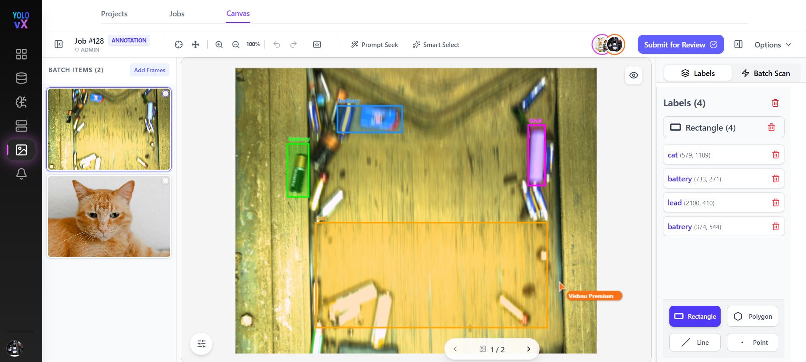
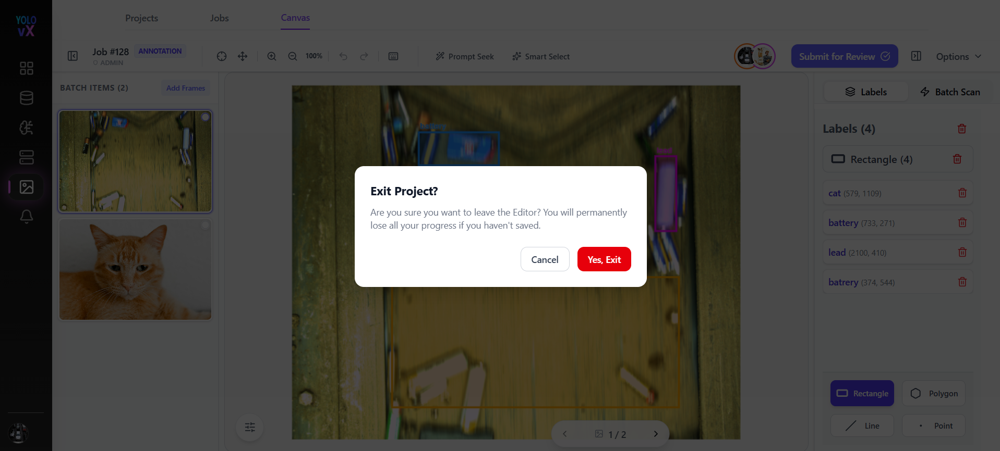
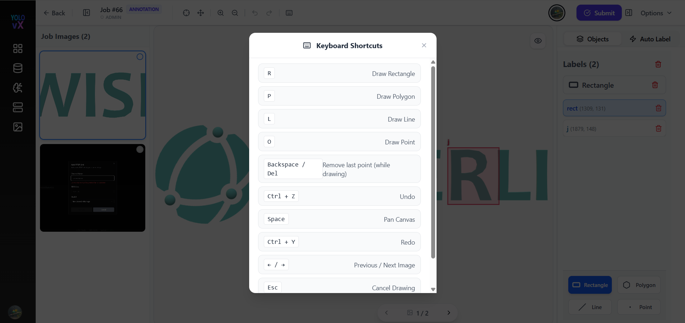
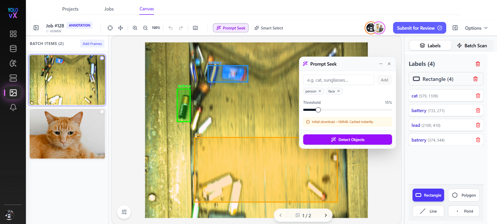
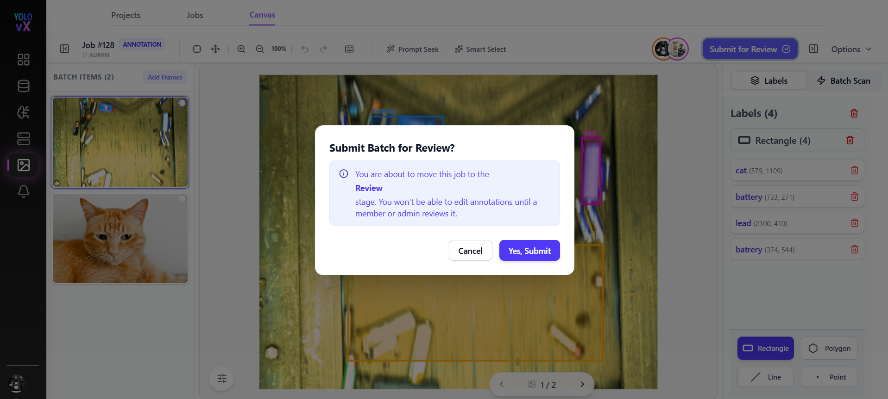
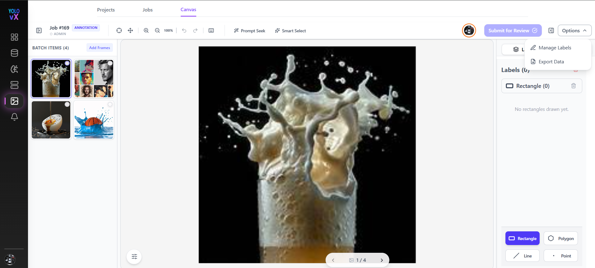
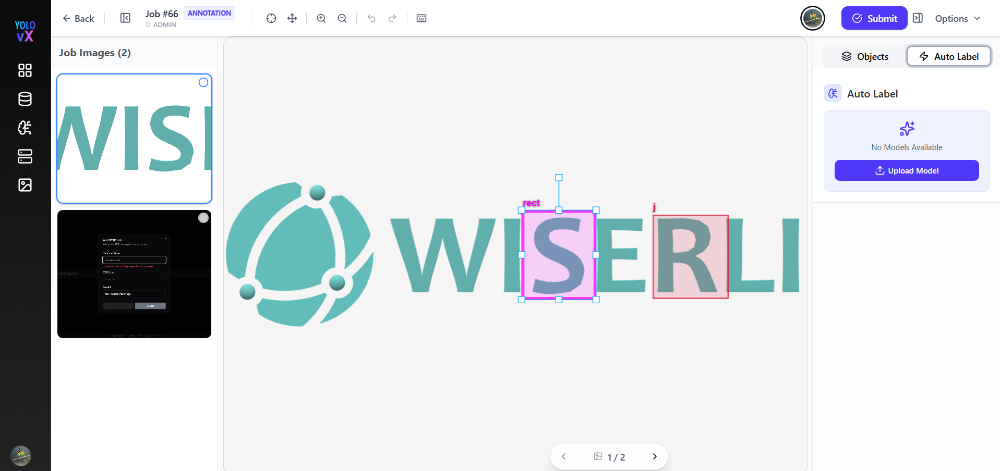
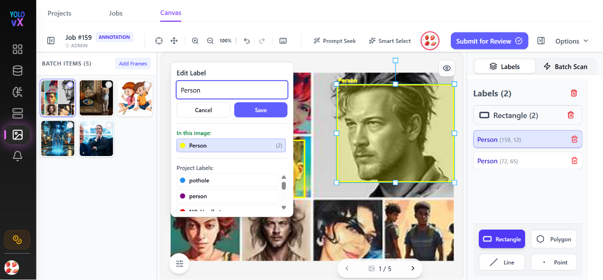
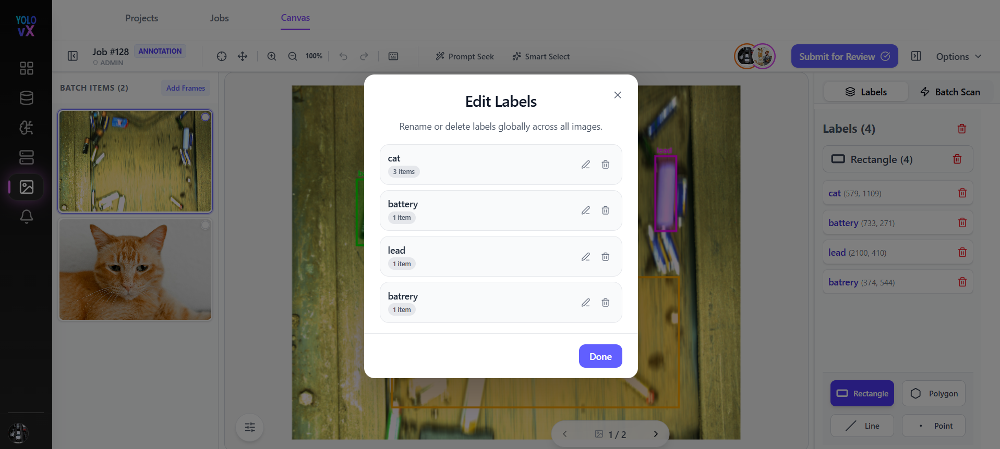
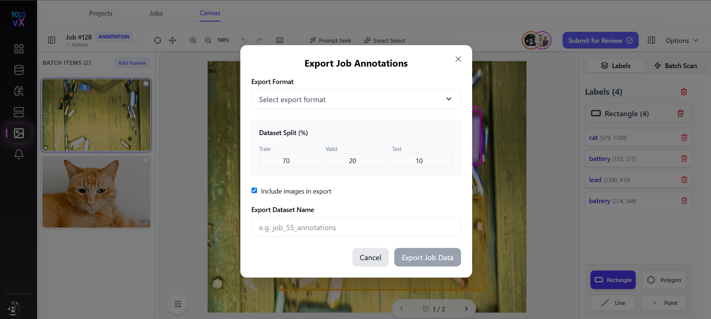

# Auto Annotation

This page is used to annotate images for object detection tasks. Annotators can draw bounding boxes, rectangles, polygons, lines, or points. This page provides all the necessary tools to create, edit, manage, review, and export annotations efficiently.

---

## Page Overview

When you open a job, the annotation workspace loads with:

- **Top Toolbar** – Navigation, zoom, undo/redo, shortcuts, and submission controls.
- **Left Panel (Job Images)** – List of images in the job.
- **Center Canvas** – Main image annotation area.
- **Right Panel (Labels & Tools)** – Object tools, labels list, and auto-label options.

---

## Top Navigation & Controls

- **Back**  
  Returns to the previous screen (job or project list).  
  If there are unsaved changes, a confirmation popup appears for confirmation. 

- **Toggle Sidebar** – On click, this hides or shows the **Job Images** section.

-  **Job #68** – Displays the current job ID.

-  **Annotation** – Indicates that the current task is in annotation mode.

-  **Admin** – Displays the role of the logged-in user.

### Toolbar Controls

-  **Pan Tool** – Move around the image canvas.
-  **Zoom In / Zoom Out** – Adjust zoom level for precise annotation.
-  **Undo / Redo** – Revert or reapply recent annotation actions.
-  **Keyboard Shortcuts** – Click the keyboard icon to view available shortcuts.  
  

**Prompt Seek** - allows users to detect and annotate objects using simple text prompts.

1. Click **Prompt Seek** from the toolbar.
2. Enter the object names you want to detect (e.g., person, face, car).
3. Adjust the detection threshold if required.
4. Click **Detect Objects**.

The system automatically identifies matching objects in the image and creates annotations, helping users annotate images faster and reduce manual effort.

### Smart Select

**Smart Select** - is an AI-assisted annotation tool that automatically identifies and selects objects within an image. Instead of manually drawing annotations, users can simply click on an object, and the system intelligently detects its boundaries and creates a more accurate selection.

This feature helps speed up the annotation process, reduces manual effort, and improves annotation accuracy.

-  **Submit** – Finalizes the annotations. On click, a popup appears; clicking **Submit** saves the annotations for the job.

- **Toggle Sidebar** – On click, this hides or shows the 
**right-side labels panel**.

-  **Options** – Opens additional settings for annotation preferences. 

---

## Left Sidebar – Job Images Panel

The left sidebar displays all images included in the current job.

### Features:

-  **Job Images (4)** – Shows the total number of images in the job.
- Thumbnail previews allow quick navigation between images.
- The currently selected image is highlighted.
- Users can scroll through images and click any thumbnail to load it into the main canvas.

---

## Center Canvas – Annotation Area

This is where annotations are drawn:

- Each object is marked with colored shapes and labels (e.g., `rect`, `rect3`).
- Selected annotations show resize handles.
- You can move, resize, or delete any annotation.

### Pagination

Navigate through job images using previous and next arrows at the bottom.

---

## Right Panel – Objects & Labels

###  Objects Tab

Displays the list of all annotations created on the current image.

-  **Auto Label** – Automatically suggests annotations using an AI model (if enabled for the project).

---

## Labels Section

Displays all labels used in the current image:

- Each label shows:
  - Label name (e.g., `rect`, `rect3`)
  - Coordinates
  - Delete icon to remove the annotation

- Labels are selectable, allowing:
  - Highlighting the corresponding shape on the canvas.
  - Editing or deleting the annotation.

---

## Label Editing & Management

###  Edit Label (Inline Panel)

When you click on a label or shape, the **Edit Label panel** opens.

#### Fields & Options:
- **Object Name Input** – Rename the label.
- **Save / Cancel** – Apply or discard changes.
- **In This Image** – Shows labels used in the current image.
- **Project Labels** – Shows all labels available in the project (e.g., `car`, `person`, `bus`, `traffic light`).

---

## Annotation Workflow

1. **Select an Image** from the left sidebar.
2. **Choose a Tool** (e.g., Rectangle).
3. **Draw on the Canvas** over the object of interest.
4. **Assign or Confirm a Label** from the labels panel.
5. Repeat for all objects in the image.
6. Navigate to the next image using the thumbnails or arrows.
7. Once all images are annotated, click **Submit** to complete the job.

---

## Submission & Review

###  Submit Button

Once all images are annotated, click **Submit**.

#### Submit Batch for Review Popup
- Confirms that the job will move to the **Review** stage.
- Warns that annotations cannot be edited after submission.
- Options:
  - **Cancel**
  - **Yes, Submit**

---

##  Manage Labels (Global)

From the **Options** dropdown, select **Manage Labels**.

#### Manage Labels Popup
- View all project labels with usage count.
- Rename any label globally across all images.
- Delete unused or incorrect labels.
- Click **Done** to save changes.

---

## Exporting Annotations

From the **Options** menu, select **Export Data**.

#### Export Job Annotations Popup
- **Export Format** – Choose output format (e.g., COCO, YOLO, JSON, etc.).
- **Include Images** – Option to bundle images with annotations.
- **Export Dataset Name** – Custom name for the export file.
- **Export Destination** – Default: Local Storage (Download).
- Actions:
  - **Cancel**
  - **Export**

---

## Exit Project Confirmation

If you try to leave the page with unsaved changes:

#### Exit Project Popup
- Message: *“Are you sure you want to leave the Editor? You will permanently lose all your progress if you haven't saved.”*
- Options:
  - **Cancel**
  - **Exit**
  

