# Project Dashboard – Progress Intelligence Hub

This page provides a complete overview of all job batches within the selected project, including their progress, status, performance metrics, and team assignments. Here user can add a new Batch of job, manage team and export annotation of the selected project.

It acts as the control center for managing annotation workflows efficiently.

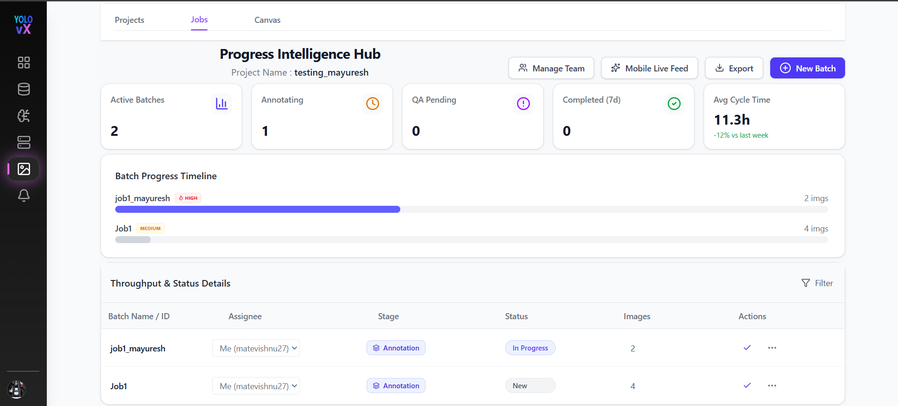

---

## Top Navigation & Actions

At the top of the page, you will find the following controls:

- **Back** – Returns to the Projects list.

- **Next** – Navigate to the next section or workflow.

- **Manage Team** – Onclick Manage Team a popup window appears where you can invite, update roles, remove, or assign team members to the project.
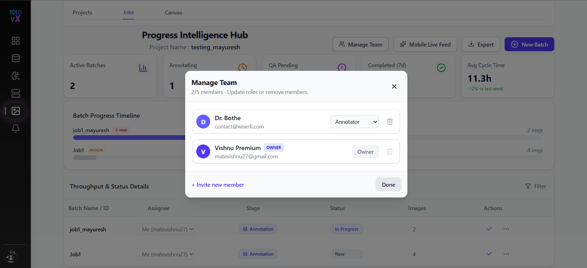

- **Mobile Live Feed** – Onclick Mobile Live Feed button a **Mobile Sync Pipeline** popup window appears. This feature allows users to connect the YOLOvX mobile application to the selected project by scanning a unique QR code.

  After scanning the QR code using the YOLOvX mobile app:

  - The mobile device is securely linked to the current project.
  - Images captured from the mobile application are automatically streamed to the platform.
  - A new batch is automatically created for the incoming images.
  - Captured images become immediately available for annotation.

  The Mobile Sync Pipeline popup includes:
  - QR Code for device pairing.
  - Connection instructions.
  - Target Session Endpoint used to identify the active project session.

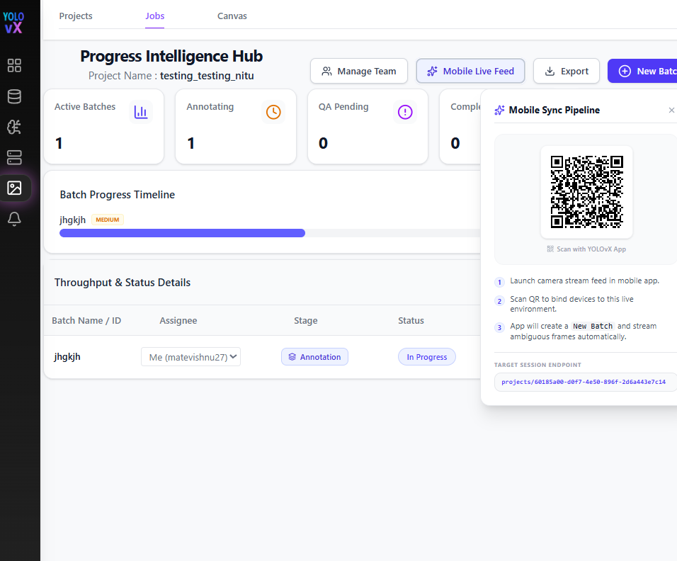

- **Export** – Onclick Export button a popup window appears where you can Download project annotation by choosing the export format, if you want you can include images in the export, add a export dataset name and choose the export destination. Then click on export button will download all the annotations data of that project.
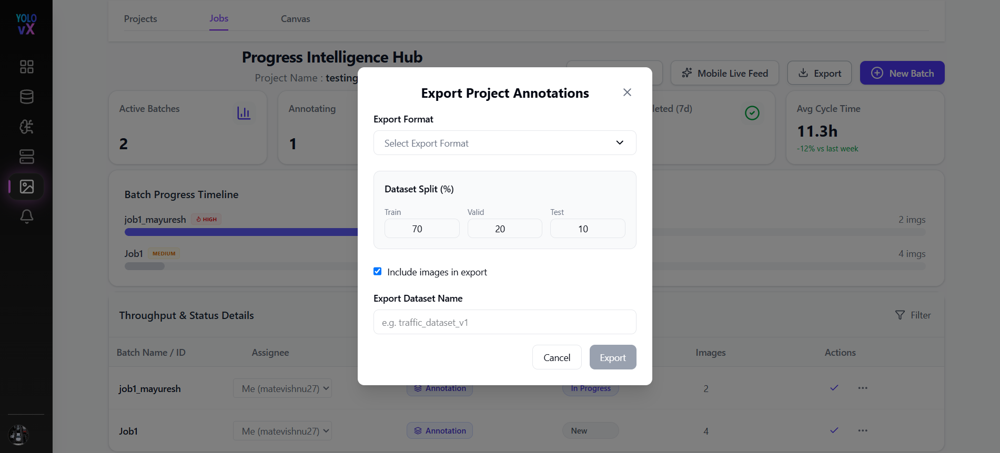

- **New Batch** –  Onclick New Batch button a popup window appears where you can create a new job batch by entering the job name, description for that job, priority and by uploading images within the project.
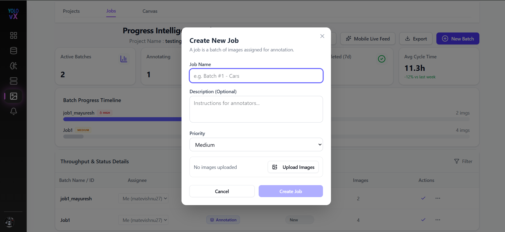

---

## Project Summary Metrics

Below the header, summary cards display real-time project statistics:

-  **Active Batches** – Number of batches currently active.
-  **Annotating** – State of batches currently under annotation.
-  **QA Pending** – Number of batches waiting for quality review.
-  **Completed (7d)** – Number of batches completed in the last 7 days.
-  **Avg Cycle Time** – Average time taken to complete a batch, with comparison to the previous week.
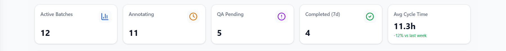

---

## Batch Progress Timeline

The **Batch Progress Timeline** visually represents the progress of each batch using progress bars:

- The right side displays the total number of images in the batch.
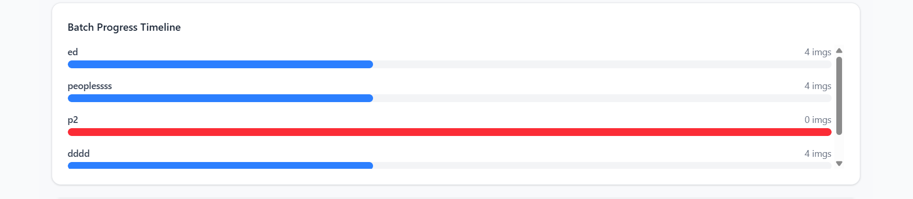
---

## Throughput & Status Details Table

This table provides a detailed breakdown of all batches in the project.
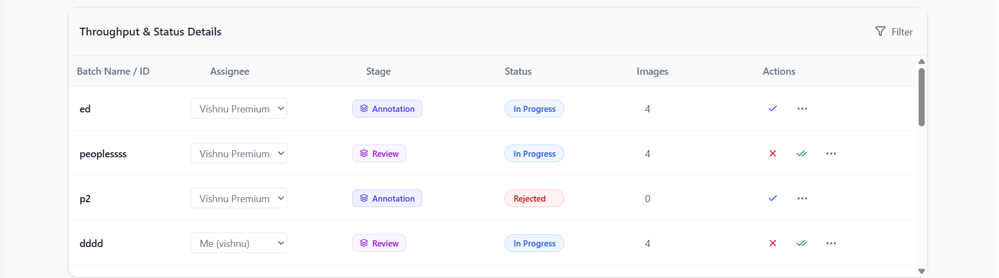

### Table Columns

-  **Batch Name / ID** – Unique identifier for each batch.

-  **Assignee** – The team member responsible for the batch. This can be changed using the dropdown.
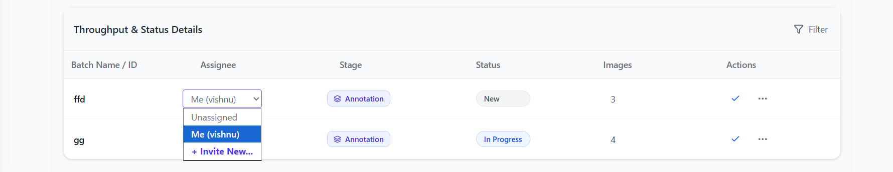

-  **Stage** – Current workflow stage (e.g., *Annotation*).

- **Status** – Current state of the batch (e.g., *New*, *In Progress*).
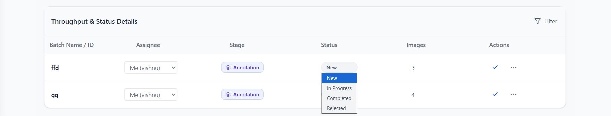

- **Images** – Number of images in the batch.

- **Actions** – Onclick Actions dots a dropdown appears where you can Edit Job, Upload images and delete Job.
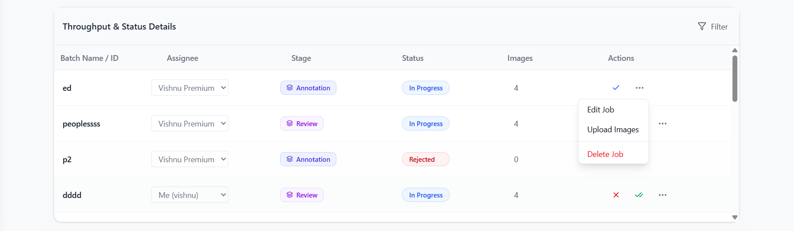

---

## Batch  Status Actions

Each batch row provides action controls:

-  **In Progress / Completed/ Rejected** – Mark the batch as completed or move it to the next workflow stage.

- ⋮ **More Options Menu** – Access additional actions such as editing batch details, uploading images, or deleting the batch.

- **Edit Job** - Onclick Edit Job a popup window appears where you can edit job name, description, and add more images or delete any existing images. Click on save changes will save these changes.
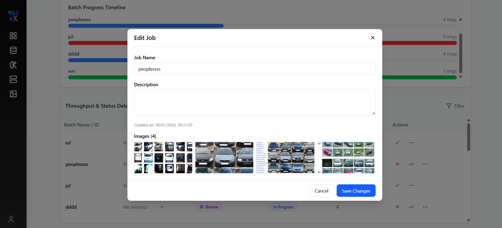

- **Add Images** - Onclick upload images a popup window appears where you can Import Images by selecting any files in jpg, png or webp format.
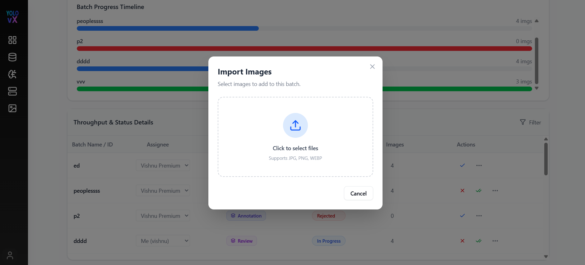

- **Clear Annotations** - Onclick clear annotations a popup window appears where we can clear all the annotations of that Batch.

- **Delete Job** - Onclick upload images a popup window appears where you can delet that Job permanently by clicking on delete button.
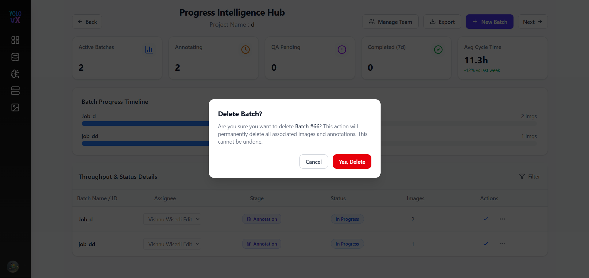 

---

## Filtering & Sorting

-  **Filter Icon** – Filter batches based on Batch name, assignee, status, stage, or images count.
- Sorting options allow you to organize batches for easier management.
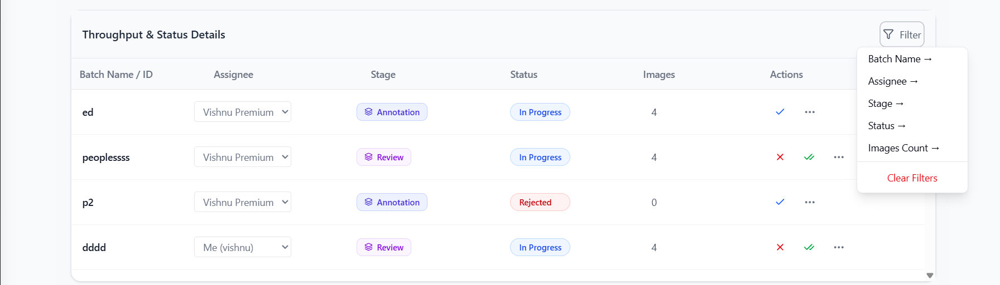

