## User Profile & Account Management

Clicking the **User Icon** in the sidebar opens the **Account Management** area.

---

## Account Settings Page

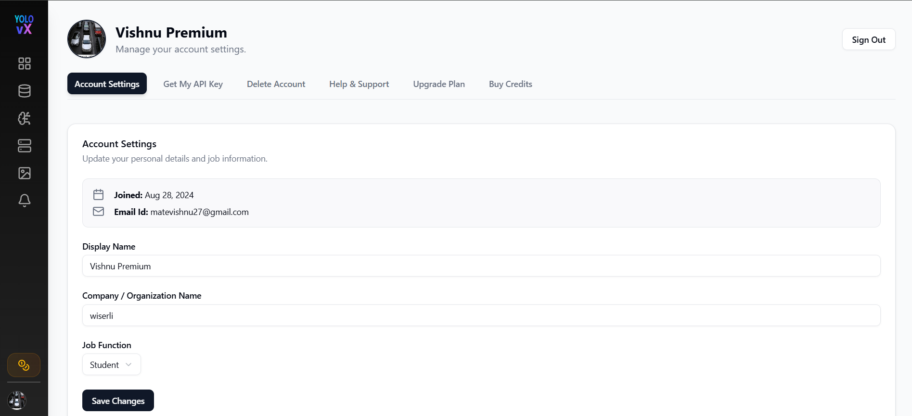

### Information Displayed:

- 📅 **Joined Date**
- 📧 **Email ID**
- 🧑 **Display Name**
- 🏢 **Company / Organization Name**
- 💼 **Job Function**

### Actions:

- **Save Changes** – Updates user profile information
- **Sign Out** – Logs the user out of the platform

---

## Get My API Key

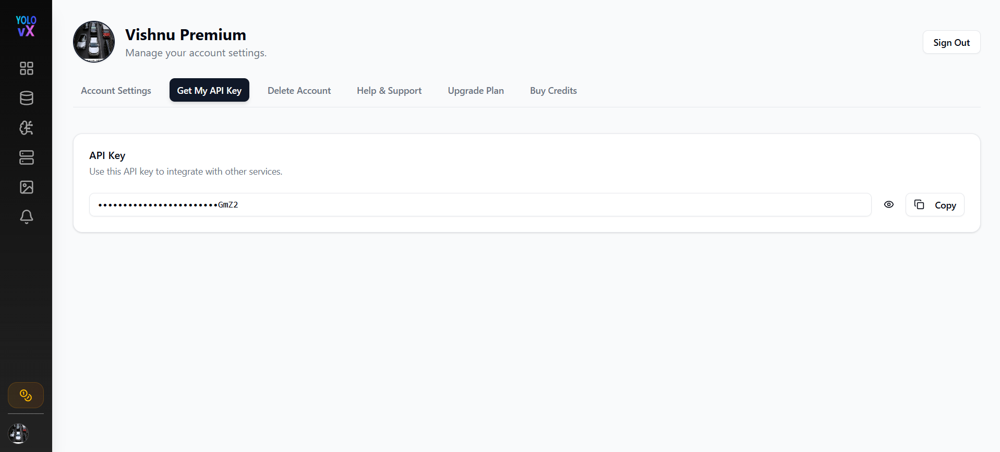

This page allows users to access their API key for integrating YOLOvX with external services.

### Features:

- 🔒 Masked API Key display
- 👁️ Toggle visibility
- 📋 Copy API Key button

---

## Delete Account

Users can permanently delete their account from the **Delete Account** tab.

⚠️ This action is irreversible and will remove all associated data and models.
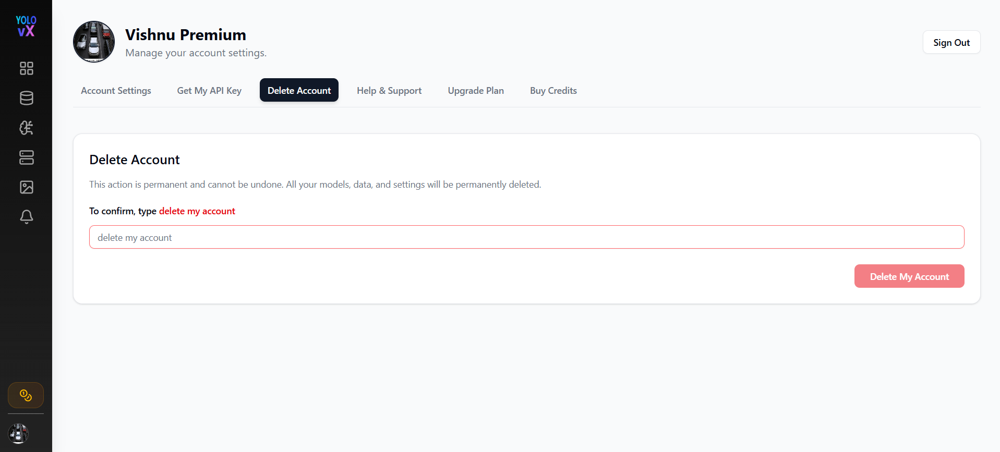
---

### 🔐 Deletion Process Flow:

1. **Enter Confirmation Text**  
   The user must type:

   in the input field to enable the **Delete My Account** button.

2. **Confirmation Popup Appears**  
Once the user clicks **Delete My Account**, a confirmation popup appears asking:

> *“Are you sure you want to delete your account?”*

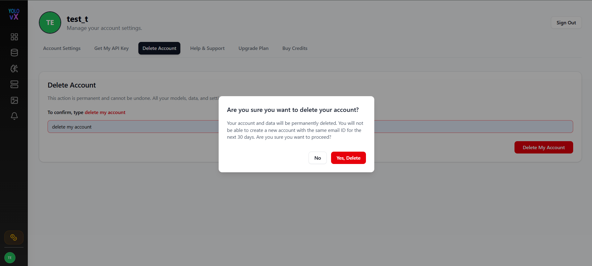

3. **User Confirms Deletion**  
When the user clicks **Yes, Delete**:

A popup box appear to show that user won't be thsi account is sent for deletion.

- The account is marked for deletion.
- The user is logged out immediately.
- All local session and storage data is cleared.
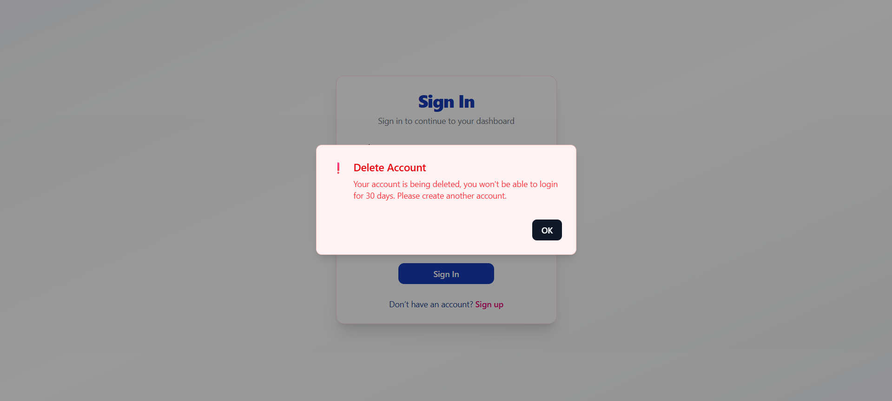

4. **Redirect to Sign-In Page with Deletion Notice**  
The user is redirected to the **Sign In** page, where a deletion status popup appears:

> **Delete Account**  
> Your account is being deleted, you won't be able to login for 30 days.  
> Please create another account.

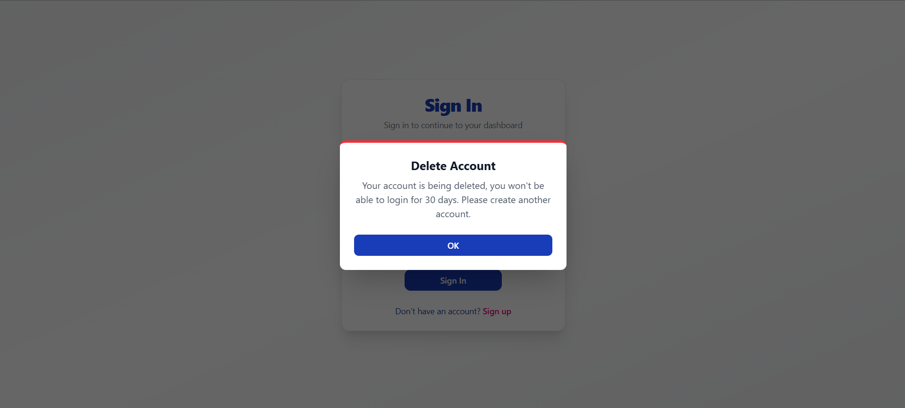

5. **Permanent Deletion Timeline**
- The account enters a **30-day grace period**.
- During this time, the user **cannot log in** using the same email.
- After 30 days, the account is **permanently deleted** from the system.

## Help & Support

The **Help & Support** page provides quick access to resources, documentation, and the latest platform updates.

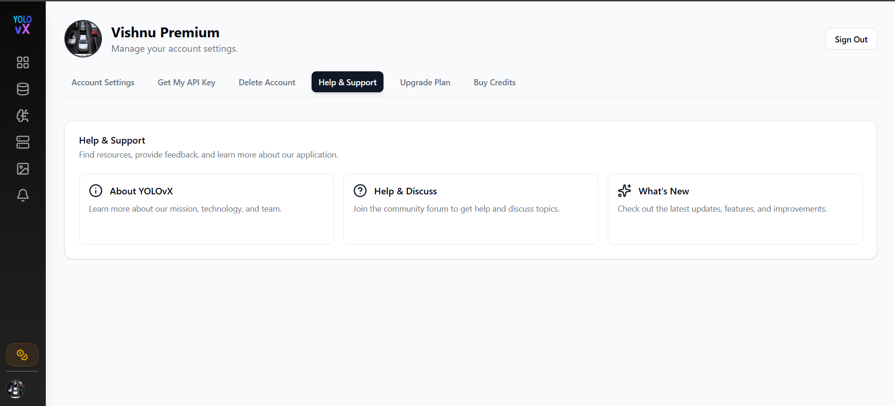

### Available Options

#### About YOLOvX

Provides information about the YOLOvX platform, including its mission, technology, and team.

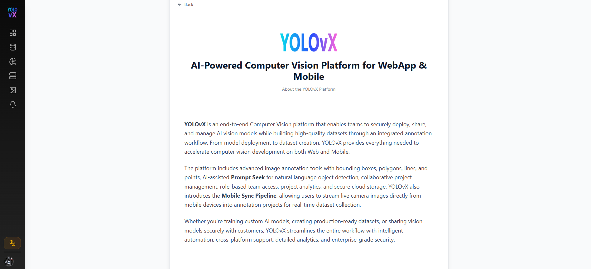

#### Help & Discuss

Redirects users to the community discussion forum where they can ask questions, report issues, and interact with other users.

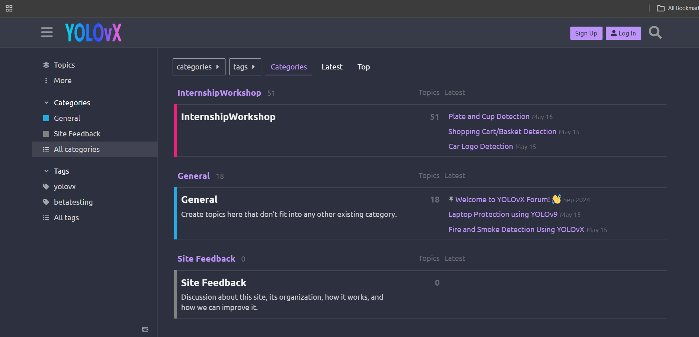

#### What's New

Displays the latest product updates, newly released features, improvements, and enhancements added to the platform.

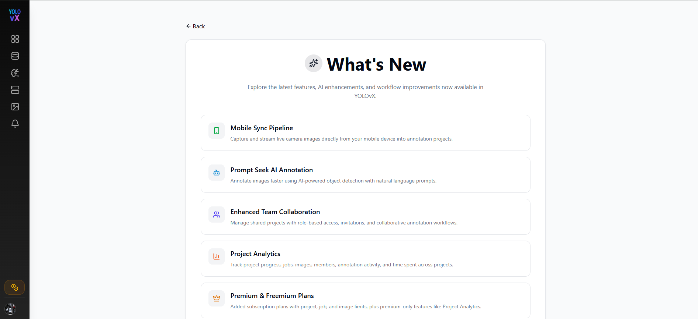

---

## Upgrade Plan

The **Upgrade Plan** page allows users to upgrade their subscription based on their annotation requirements.

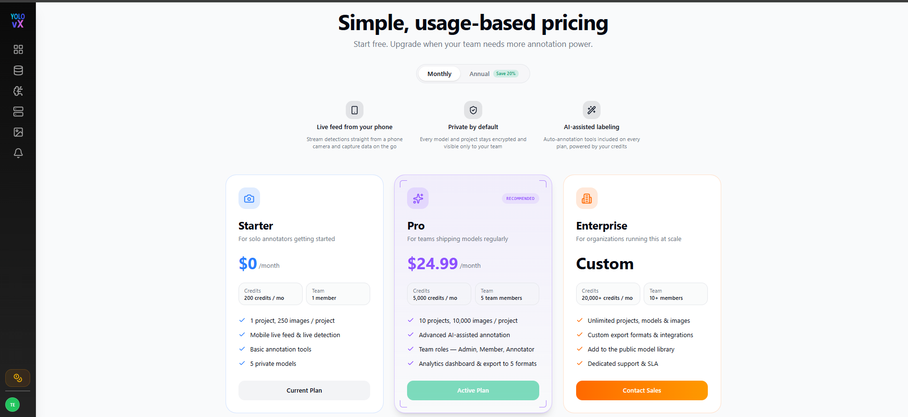

### Available Plans

- **Starter** – Free plan for individual users with basic annotation features.
- **Pro** – Includes more credits, additional projects, team collaboration, analytics, and AI-assisted annotation tools.
- **Enterprise** – Custom plan offering unlimited resources, custom integrations, and dedicated support.

### Features

- Switch between **Monthly** and **Annual** billing (20% savings on annual plans).
- View a detailed **Plan Comparison** table.
- Upgrade to a higher plan at any time.

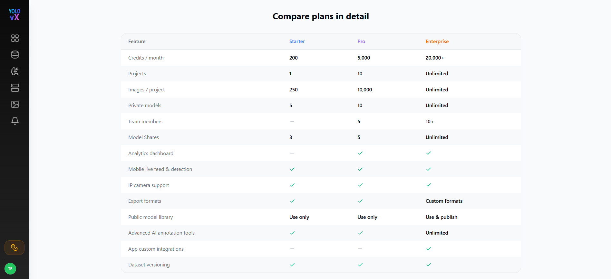

- - Selecting the **Pro** plan redirects users to **Razorpay** for payment.
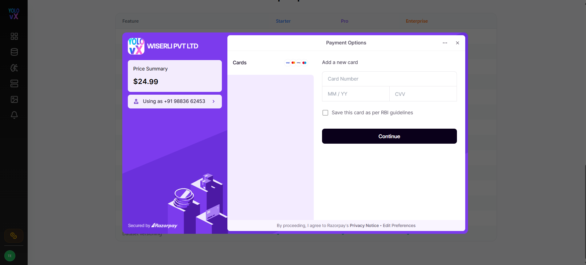

- Selecting the **Enterprise** plan redirects users to the **Contact Sales** page, where they can submit an inquiry by providing their **Full Name**, **Company**, **Email Address**, **Phone Number**, **Team Size**, and **Use Case**. Once the form is completed, clicking **Send Message** submits the request to the sales team.

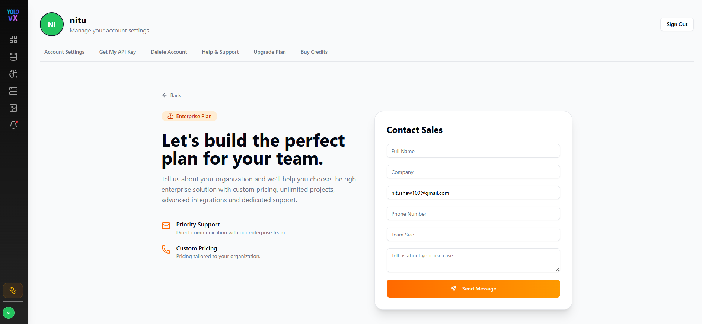

- Clicking the **Email** icon on the Contact Sales page automatically opens the user's default Microsoft Outlook email composer (or the default mail client) with the **sales@wiserli.com** email address pre-filled, allowing users to quickly contact the sales team directly.

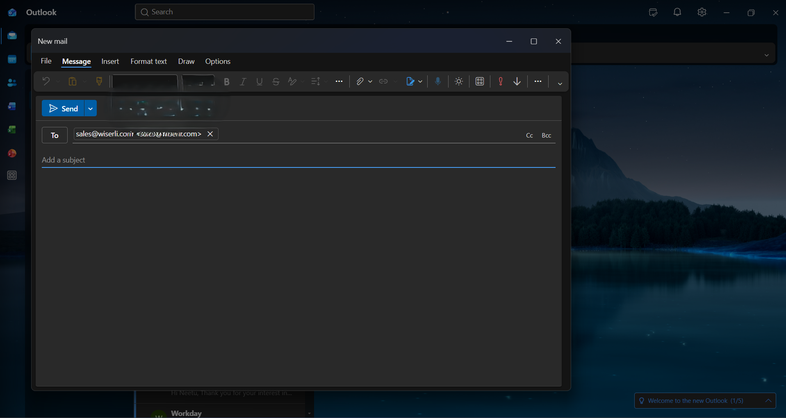
---

## Buy Credits

The **Buy Credits** page allows users to purchase additional credits for AI-powered annotation features.

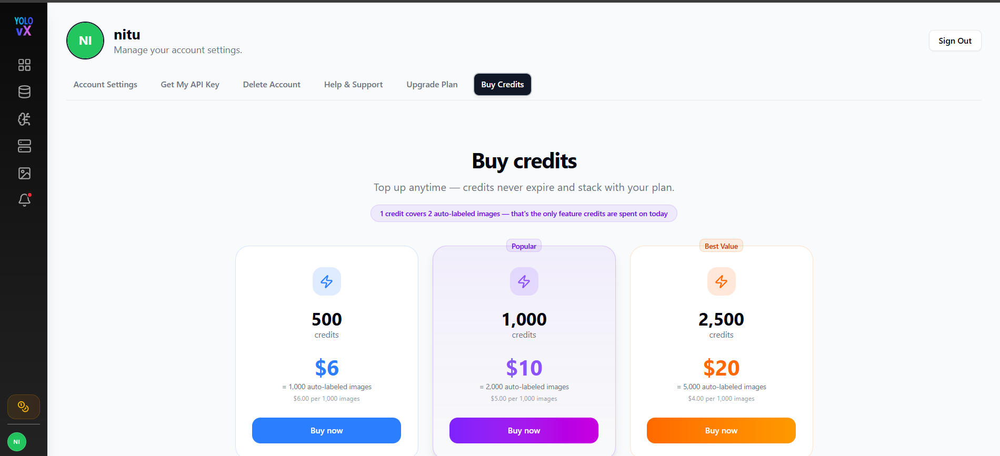

### Available Credit Packs

- **500 Credits** – $6
- **1,000 Credits** – $10 *(Popular)*
- **2,500 Credits** – $20 *(Best Value)*

### Features

- Credits can be purchased anytime.
- Purchased credits are added instantly to the account.
- Credits never expire and stack with the user's existing plan credits.
