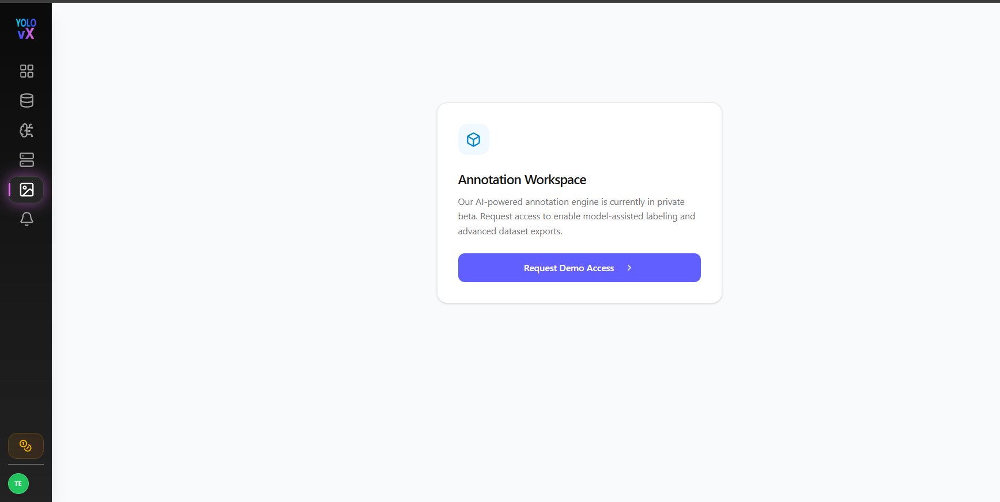
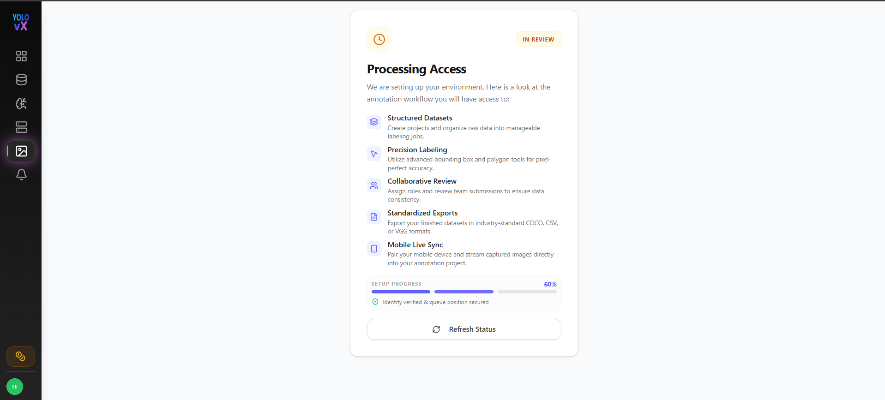
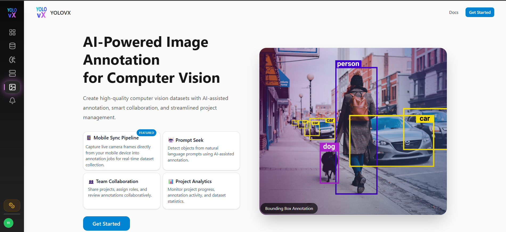
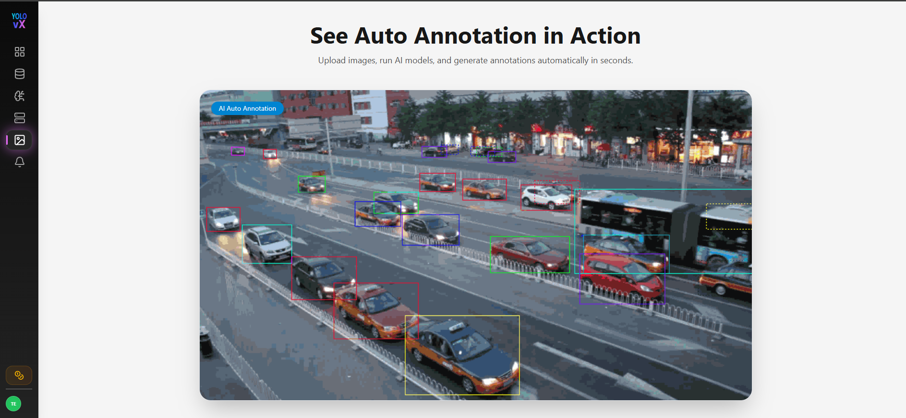
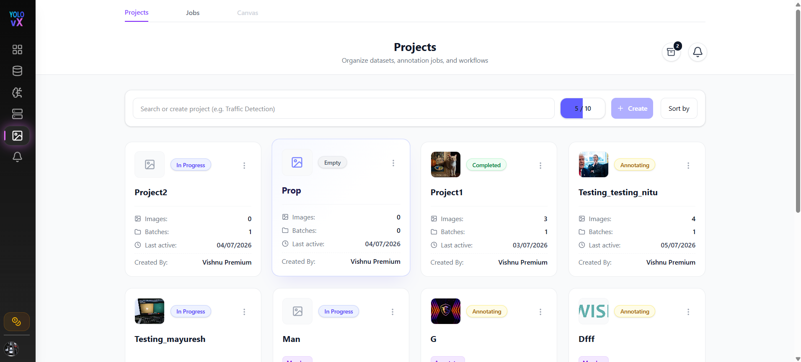
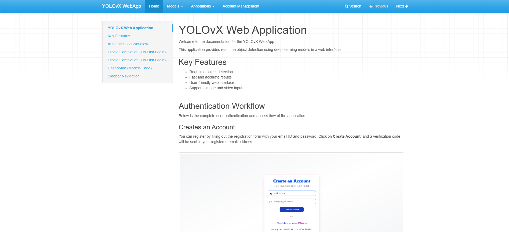

# Introduction

The YOLOvX Annotation Workspace enables users to create high-quality image annotations using AI-powered tools. It supports object detection, segmentation, and classification workflows, helping teams prepare datasets faster and more accurately.

---

## Annotation Access

When a user opens the **Annotation** module for the first time, annotation access is not available by default.

The user is presented with the **Annotation Workspace** page and must click **Request Demo Access** to request access to the annotation platform.

After submitting the request, the account enters the review process.

The **Processing Access** page displays:

- Current access status
- Setup progress
- **Refresh Status** button to check approval status

Once the request is approved, the user is automatically redirected to the **Get Started** page.

---

## Get Started

After approval, the **Get Started** page is displayed, providing access to the annotation workspace.

### Key Capabilities

- 🤖 **Prompt Seek** – Generate AI-assisted annotations using natural language prompts.
- 📱 **Mobile Sync Pipeline** – Capture and stream images directly from mobile devices into annotation projects.
- 👥 **Team Collaboration** – Share projects, assign roles, and review annotations collaboratively.
- 📊 **Project Analytics** – Monitor project progress, annotation activity, and dataset statistics.
- 🏷️ **Advanced Annotation Tools** – Create bounding box, polygon, polyline, point, and segmentation annotations.
- ⚡ **AI Auto Annotation** – Automatically generate annotations using AI models to reduce manual effort.
- 📤 **Multiple Export Formats** – Export datasets in formats such as YOLO, COCO, Pascal VOC, CSV, and VGG.

### Auto Annotation

Users can upload images, run AI models, and automatically generate annotations within seconds. Generated annotations can be reviewed and edited before exporting.

---

## Annotation Workflow

1. Upload images or videos.
2. Create or select annotation labels.
3. Choose the annotation tool (Bounding Box, Polygon, etc.).
4. Run AI Auto Annotation (optional).
5. Review and edit annotations.
6. Save and export the dataset in supported formats such as **YOLO, COCO, Pascal VOC, CSV, or VGG**.

---

## Projects

Click **Get Started** to navigate to the **Projects** page, where users can:

- Create a new project
- View existing projects
- Manage annotation datasets

---

## Documentation

Click the **Docs** button to open the complete YOLOvX WebApp documentation.

