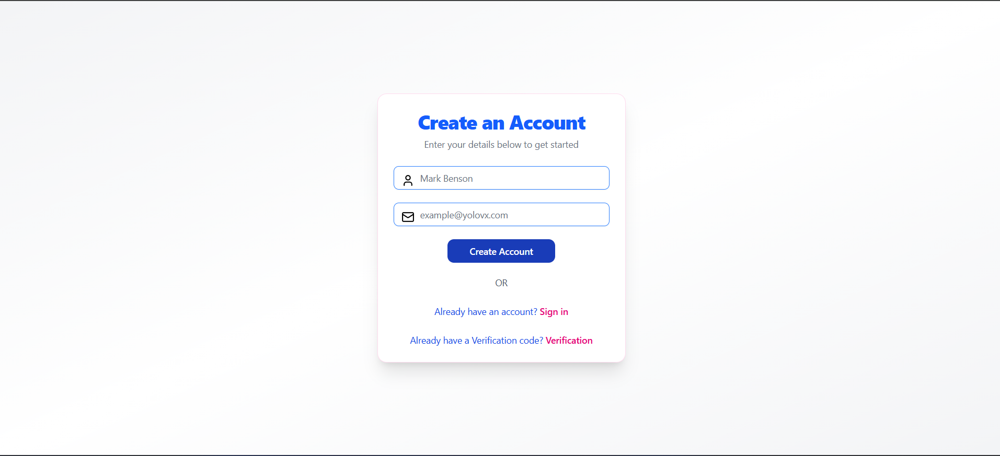
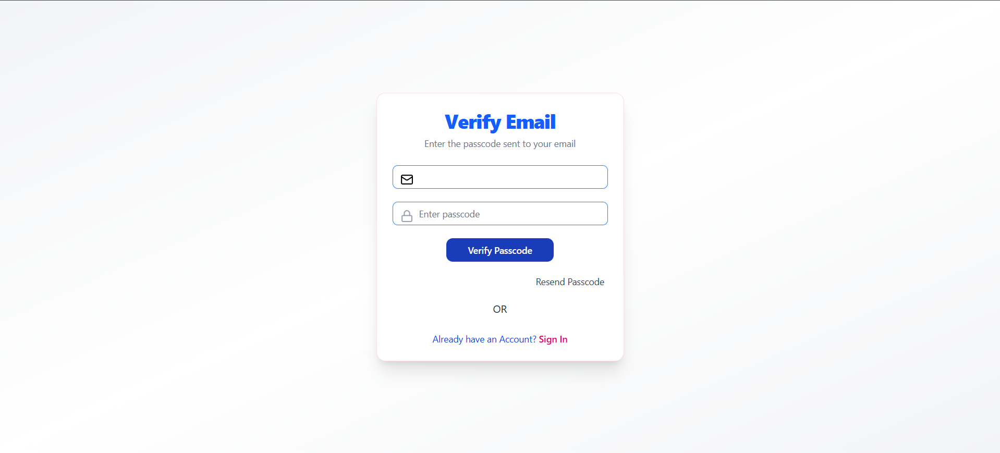
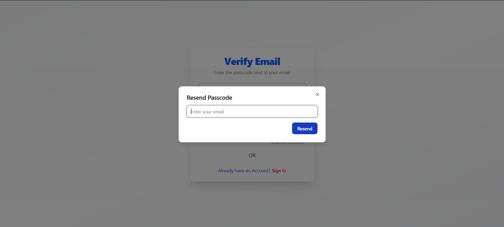
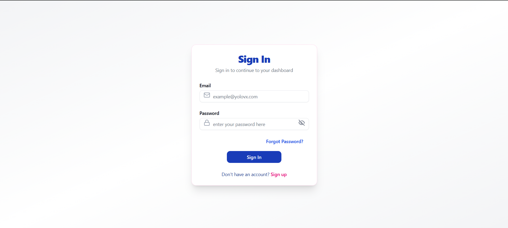
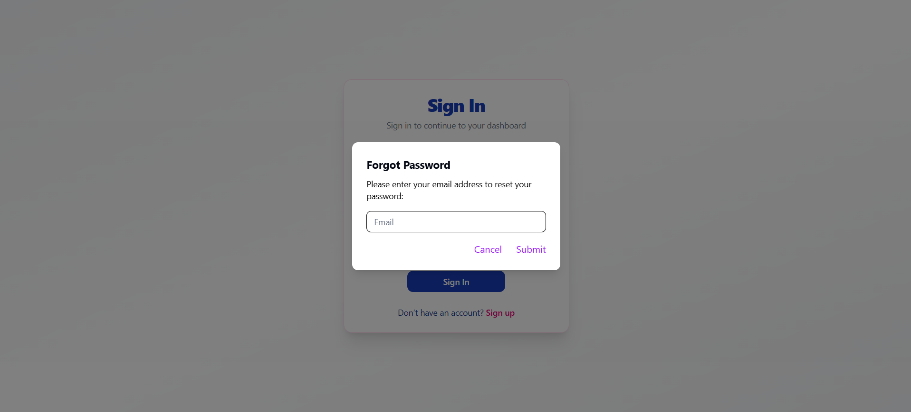
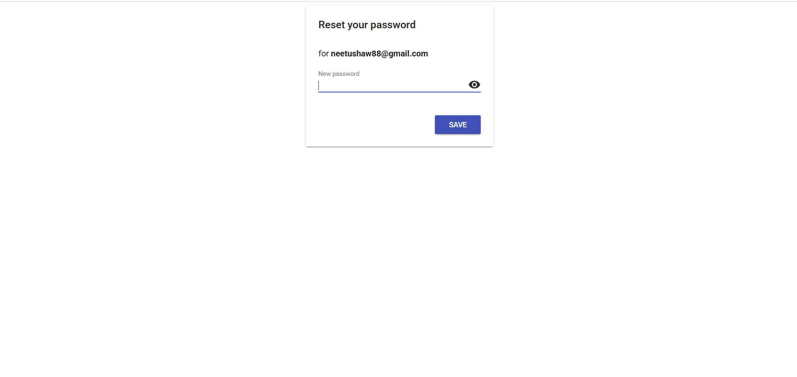
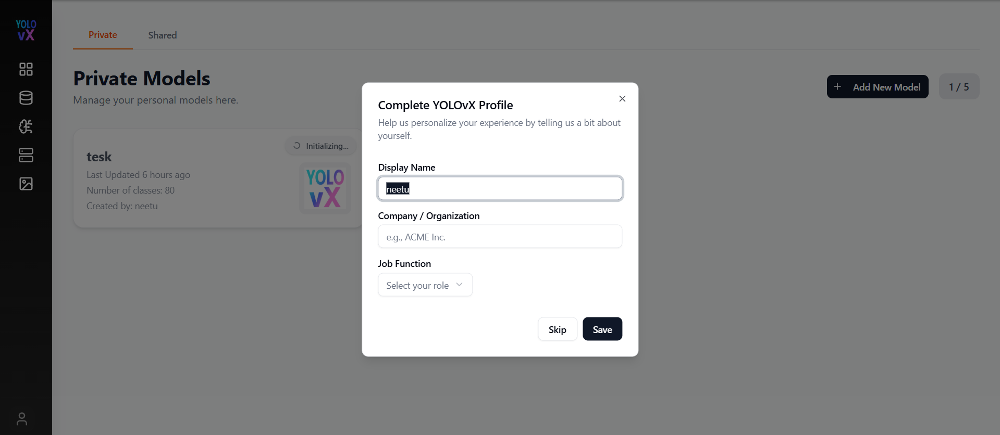

# Authentication & User Onboarding

Complete step-by-step guide for account creation, email verification, passcode resets, and initial profile configuration in YOLOvX.

---

## Account Registration

You can register by filling out the registration form with your email address and password. Click **Create Account** to trigger a verification code sent to your registered email address.

---

## Email Verification

Enter the verification code received in your inbox into the verification field and click **Verify Passcode**.

If you entered an incorrect or expired code, click **Resend Passcode** to generate a new verification token.

---

## User Sign-In

Once verified, log in using your registered credentials.

---

## Password Recovery

If you forget your password, select **Forgot Password**, submit your email, and follow the link sent to your inbox to reset your password.

---

## Profile Setup (First Login)

Upon first successful sign-in, complete your profile modal with your Display Name, Organization, and Job Role before proceeding to the dashboard.

