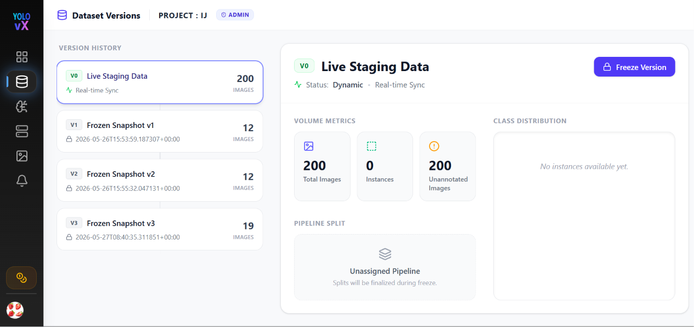
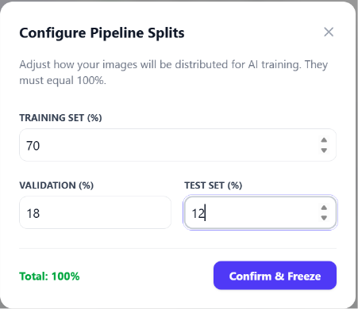
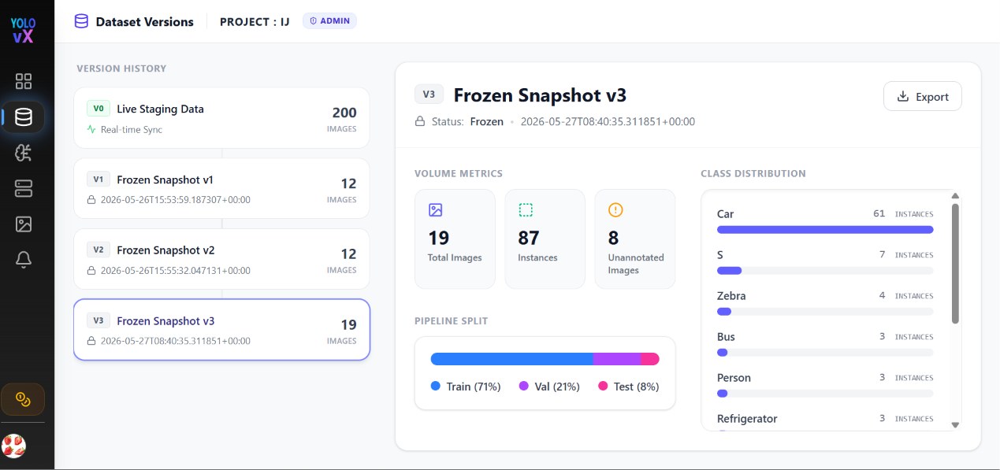

# Datasets – Version Management

The **Datasets** page lets you manage versioned snapshots of your annotation data for a project. Access it from the sidebar (**Datasets**) while a project is open, or navigate to `/projects/:projectId/datasets`.

Dataset versioning separates **live staging data** (actively being annotated) from **frozen snapshots** (locked versions ready for training or export).

---

## Accessing Dataset Versions

1. Open the **Annotations** module and go to **Projects**.
2. Click a project to open the **Project Dashboard**.
3. Click **Datasets** in the sidebar, or navigate via the project context.

> If no project is selected, clicking **Datasets** in the sidebar prompts you to select a project first.

---

## Page Layout

The page is divided into two main sections:

### Left Panel – Version History

A timeline of all dataset versions for the project:

| Version | Description |
|---------|-------------|
| **v0 – Live Staging Data** | Real-time sync of current project images and annotations. Status: **dynamic** (updates as you annotate). |
| **v1, v2, …** | Frozen snapshots created from the live staging pool. Status: **locked** (immutable). |

Each version card shows:

- **Version tag** (e.g., `v0`, `v1`, `v2`, `v3`)
- **Version name**
- **Created timestamp** (or *"Real-time Sync"* for `v0`)
- **Total image count**

Click any version to view its specific metrics in the right panel.

---

## Live Staging Data (v0)

The **v0** version represents your project's current, in-progress dataset:

- **Status:** Dynamic — counts update in real time as images and annotations are added.
- **Volume Metrics:**
  - **Total Images** – All images in the current project pool.
  - **Instances** – Total annotation instances across all images.
  - **Unannotated Images** – Images waiting to be annotated.
- **Pipeline Split:** Displays **Unassigned Pipeline** (splits are defined when freezing a version).
- **Class Distribution:** Live bar chart showing instance counts per label (*"No instances available yet"* when starting fresh).

  

### Freezing a Version

When your staging data is ready, click **Freeze Version** in the top right corner to convert your live data into a frozen snapshot:

1. Click **Freeze Version**.
2. The **Configure Pipeline Splits** modal opens.
3. Adjust the train, validation, and test percentages (must total **100%**):
   - **Training Set (%)** – Default: 70%
   - **Validation (%)** – Default: 20% (or custom, e.g., 18%)
   - **Test Set (%)** – Default: 10% (or custom, e.g., 12%)
4. Click **Confirm & Freeze**.

  

---

## Frozen Versions (v1+)

Frozen versions are read-only, immutable snapshots created from `v0` staging data.

  

### Volume Metrics

- **Total Images** – Finalized count of images locked in this version.
- **Instances** – Total frozen annotation count.
- **Unannotated Images** – Remaining unlabelled images at the time of freeze.

### Pipeline Split

A visual progress bar displaying the configured distribution:

- **Train** (blue)
- **Val** (purple)
- **Test** (pink)

### Class Distribution

A scrollable breakdown of all label classes with exact instance counts and visual percentage bars.

### Exporting Snapshots

Click the **Export** button in the top right of any frozen version card to download annotations for training. See [Export Formats](Auto_annotation.md#exporting-annotations) for supported dataset exports.

---

## Role-Based Access

Your active role badge is displayed in the page header:

| Role | Access Permissions |
|------|--------------------|
| **Admin** | Full access — freeze versions, export data |
| **Member** | View version history and volume metrics |
| **Annotator** | View version history and volume metrics |

> Team management and role configurations require a **Pro** plan. See [Upgrade Plan](account_management.md#upgrade-plan).

---

## Navigation

- **PROJECT : [NAME]** (uppercase header link) – Returns to the [Project Dashboard](JobBatch.md).
- **Dataset Versions** title – Indicates current page context.

---

## Workflow Summary

1. **Annotate:** Create job batches and annotate images in your workspace.
2. **Monitor:** Track real-time progress on **v0 Live Staging Data**.
3. **Freeze:** Click **Freeze Version** and set your **Train/Val/Test** percentages.
4. **Export:** Download the frozen snapshot for training or external pipelines.
5. **Iterate:** Continue annotating — `v0` updates continuously while frozen snapshots remain locked.