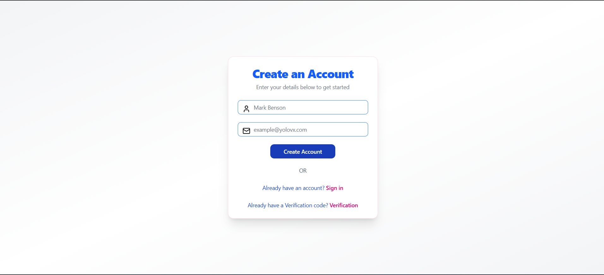
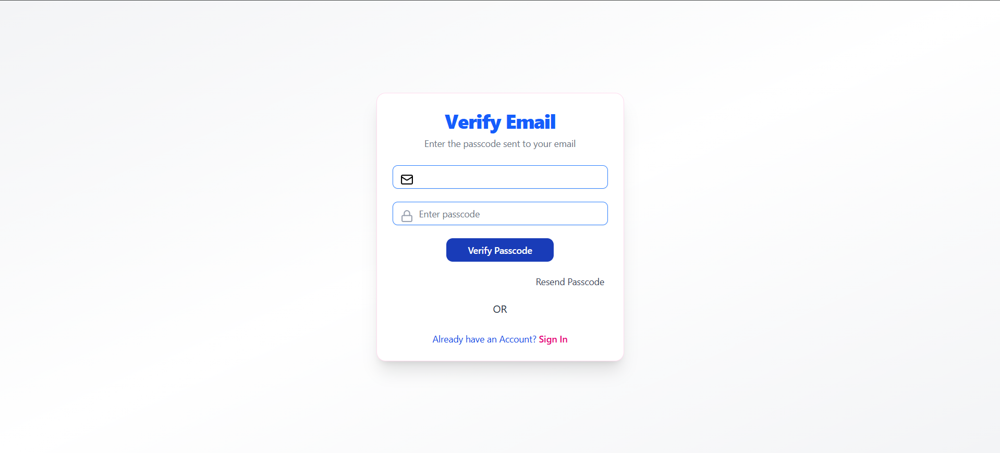
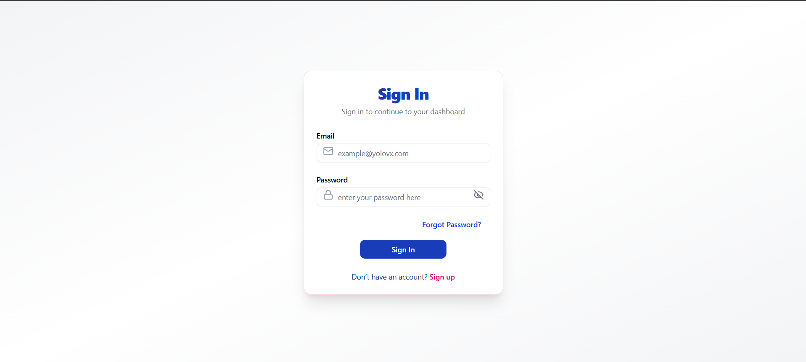
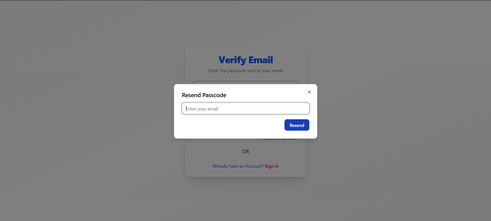
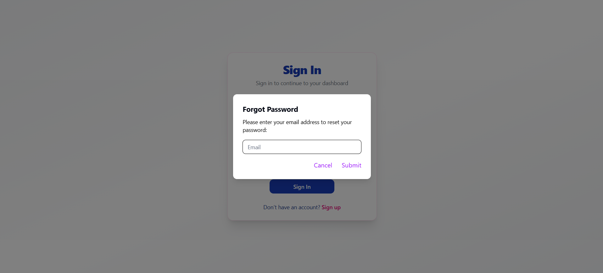
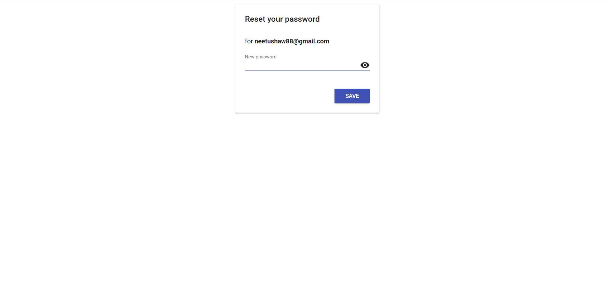
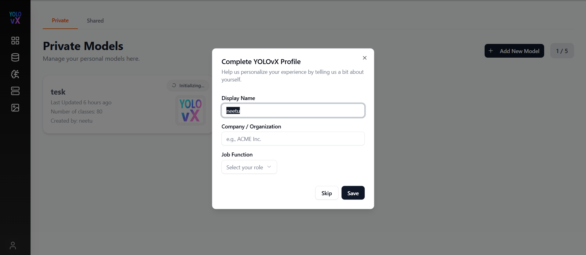
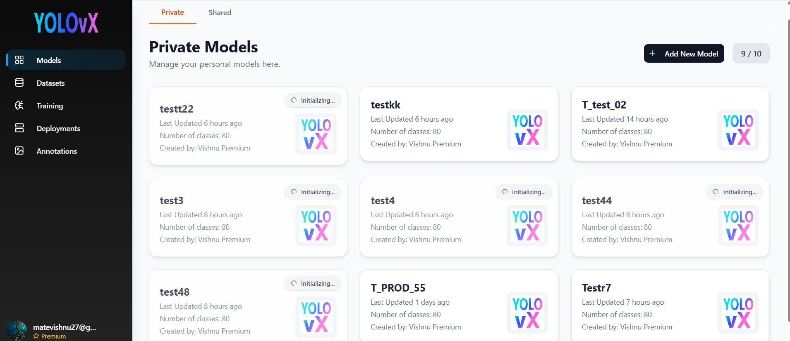

# YOLOvX Web Application

Welcome to the documentation for the YOLOvX Web App.

This application provides real-time object detection using deep learning models in a web interface.

## Key Features

* Real-time object detection
* Fast and accurate results
* User-friendly web interface
* Supports image and video input

---

## Authentication Workflow

Below is the complete user authentication and access flow of the application.

###  Creates an Account

You can register by filling out the registration form with your email ID and password. Click on **Create Account**, and a verification code will be sent to your registered email address.

---

###  Verify Account 

After creating an account, a verification code is sent to your registered email. Enter this code in the verification field and click the **Verify Passcode** button.

---

Once the verification code is successfully validated, you will be redirected to the sign-in page.

---

###  Resend Passcode

If you enter an incorrect code, you can click **Resend Passcode** to receive a new one. Then enter the new passcode to verify your email address.

---

###  Signs In

You can sign in using the credentials created during registration.

---

###  Forgot Password 

If you forget your password, click **Forgot Password**, enter your email address, and a password reset link will be sent to your email. 

---

Click the link to open the reset form, enter your new password, and submit. Your password will be successfully updated, and you will be redirected to the Sign-In page to log in.

---

## Profile Completion (On First Login)

After a successful login, the system checks whether the user’s profile information is complete.

If the profile is **incomplete**, a modal popup appears prompting the user to update their profile before continuing.

### When This Appears
- Triggered immediately after login
- Displayed only if required profile details are missing
- Blocks interaction with the dashboard until the user **saves** or **skips**

## Profile Completion (On First Login)

After login, the system checks if the user profile is complete.  
If required details are missing, a **“Complete YOLOvX Profile”** modal is shown before accessing the dashboard.

The modal allows users to enter:
- **Display Name**
- **Company / Organization** (optional)
- **Job Function**

Users can **Save** to update their profile or **Skip** to continue.  
Once completed, this popup will not appear again on future logins unless the profile becomes incomplete.

## Dashboard (Models Page)

Once you log in successfully, you will be redirected to the **dashboard**, starting with the **Models** page.

---

## Sidebar Navigation

After logging in, a sidebar appears on the left side of the application providing quick access to key modules:

-  **Models**
-  **Datasets**
-  **Training**
-  **Deployments**
-  **Annotations**

At the **bottom-left corner** of the sidebar, a **User Icon** is displayed. Clicking this icon opens account-related options such as:

