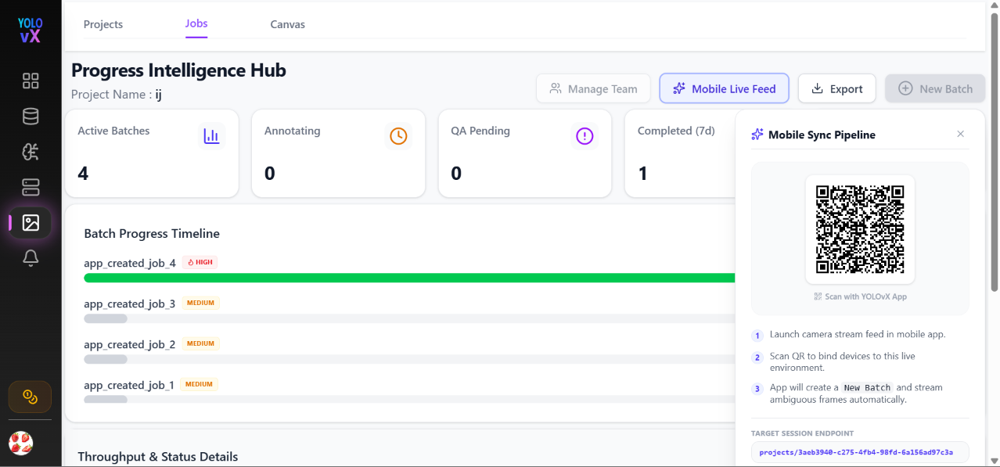
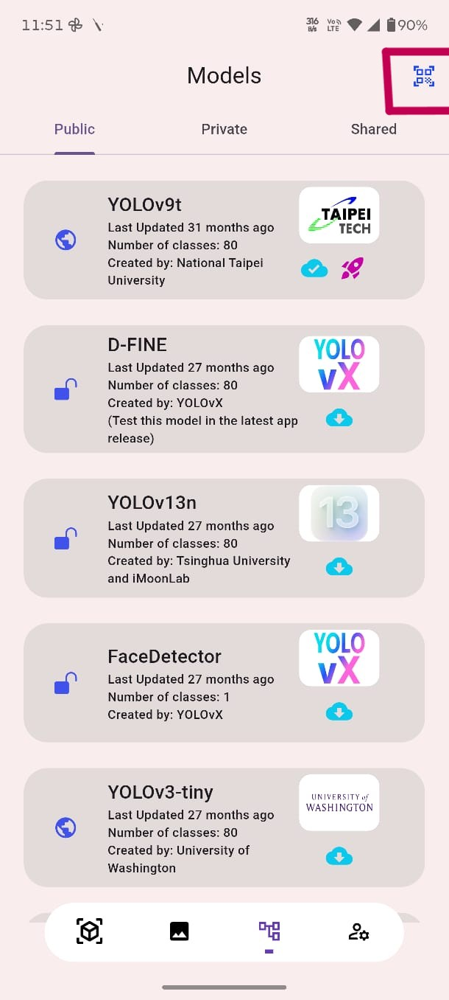
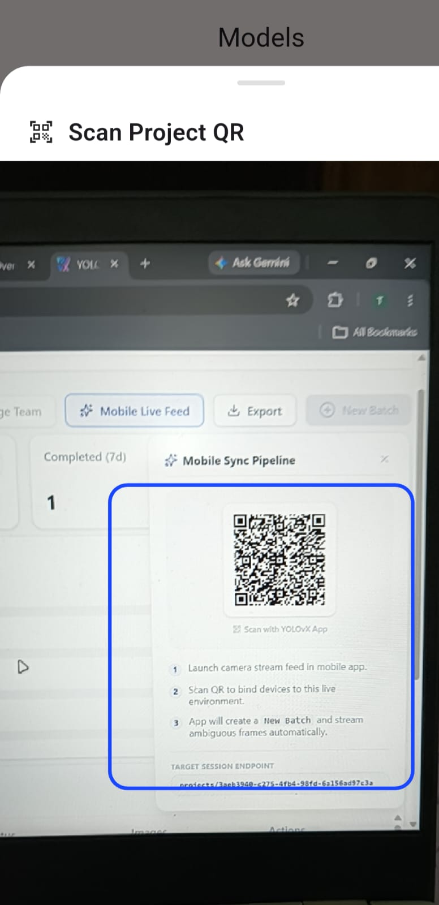
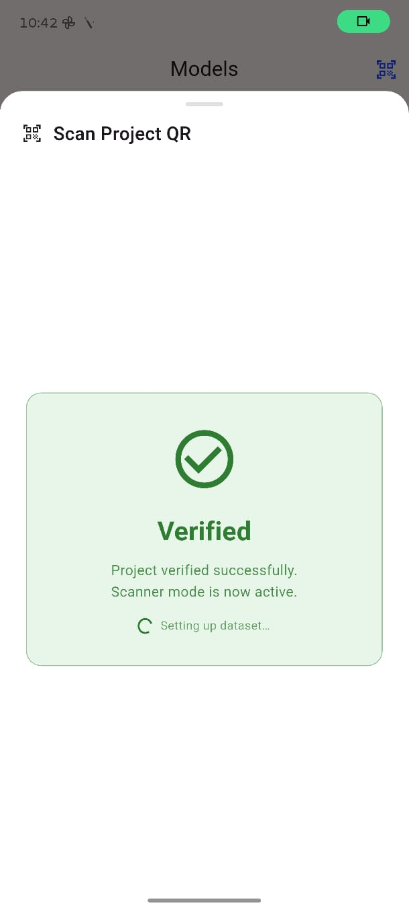
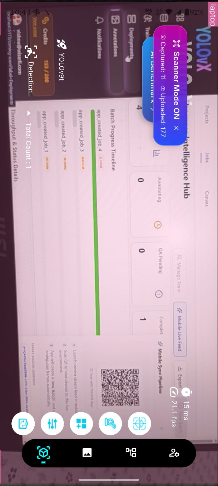
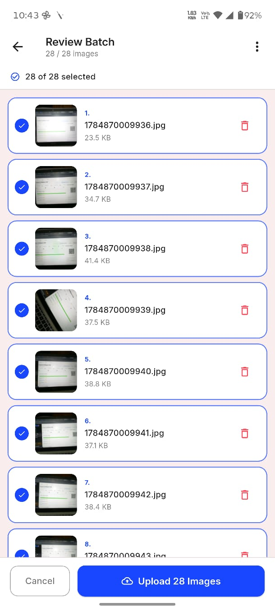
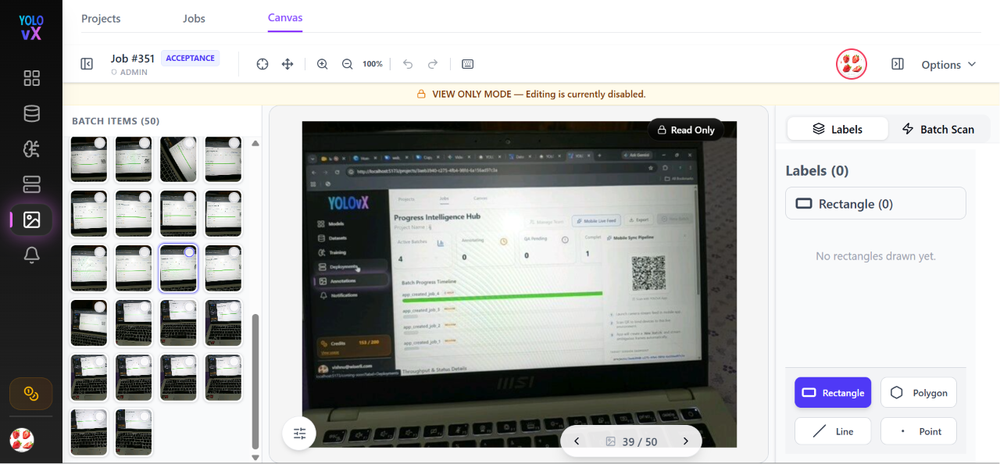

# Mobile Sync Pipeline

The **YOLOvX Mobile Sync Pipeline** enables real-time frame capturing and instant synchronization between the **YOLOvX Mobile App** and your **YOLOvX Web Annotation Canvas**. 

With this pipeline, field engineering teams can collect edge cases or field data and stream captured frames directly into web annotation jobs without manual file transfers.

---

##  Step 1: Open the Mobile Sync QR Code on Web

1. Log in to the [YOLOvX Web Application](https://web.yolovx.com).
2. Navigate to **Annotations** → **Jobs** (or open your target project in **Progress Intelligence Hub**).
3. Click the **Mobile Live Feed** button in the top action toolbar.
4. A **Mobile Sync Pipeline** modal will appear displaying a unique session QR code and target session endpoint.

  

---

##  Step 2: Pair Mobile App via QR Code

1. Open the **YOLOvX Mobile App** on your iOS or Android device.
2. Tap the **Scan Project QR** icon in the header.
3. Align your smartphone camera with the QR code displayed on the YOLOvX Web interface.

| Mobile Scanner View | Scanning Web Screen |
| :---: | :---: |
|  |  |

4. Once scanned, the mobile app will display a **Verified** card: *"Project verified successfully. Scanner mode is now active."*

  

---

##  Step 3: Stream & Capture Live Detection Frames

1. After verification, launch the camera feed inside the mobile app.
2. The active **Scanner Mode ON** banner will show real-time metrics for **Captured** and **Uploaded** frames.
3. Frames exhibiting low model confidence or edge-case detections are automatically captured during the live session.

  

---

##  Step 4: Review Batch & Upload to Web Workspace

1. When field collection is complete, tap **Review Batch** on your mobile app.
2. Review all captured images, select/deselect specific frames, or remove blurry shots.
3. Tap **Upload Images** to send the batch directly into your web project workspace.

  

---

## Step 5: Instant Synchronization to Web Canvas

1. Return to the **YOLOvX Web App** workspace.
2. Under the **Canvas** or **Jobs** tab, a new batch (e.g., `Job #351`) will automatically appear with all synchronized mobile frames.
3. Annotation team members can immediately begin **Manual Labeling** or apply **Model Auto-Labeling** to the newly synced batch.

  

---

> 💡 **Key Benefit:** YOLOvX Single Sign-On (SSO) ensures your project permissions, credentials, and dataset batches seamlessly stay in sync across desktop browsers and mobile devices.