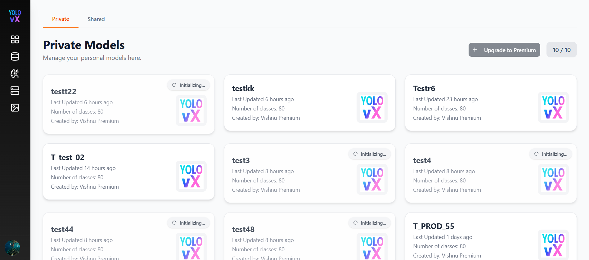
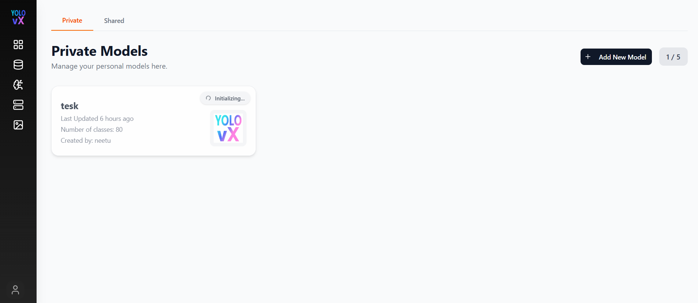
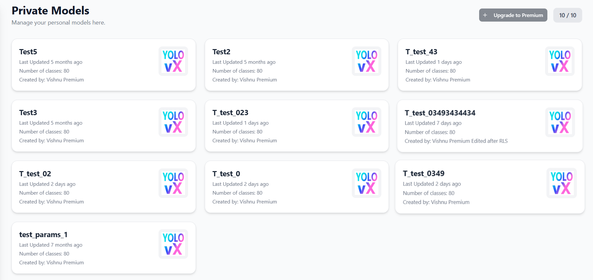
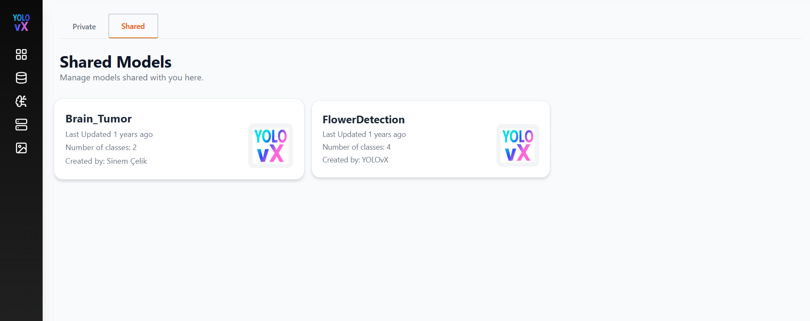
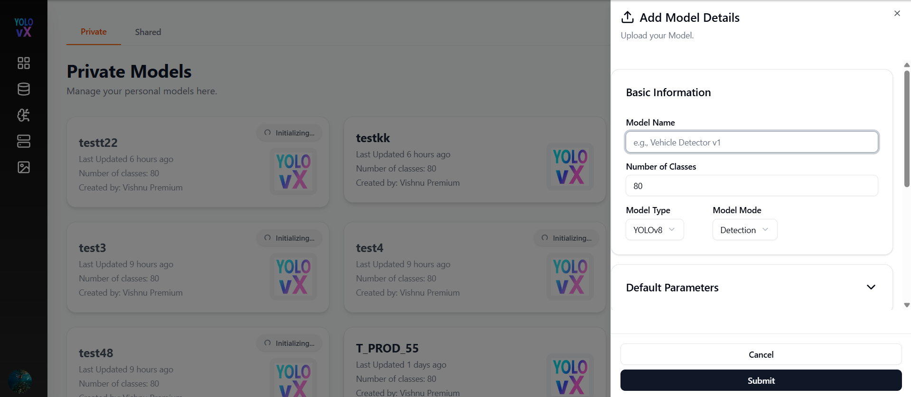
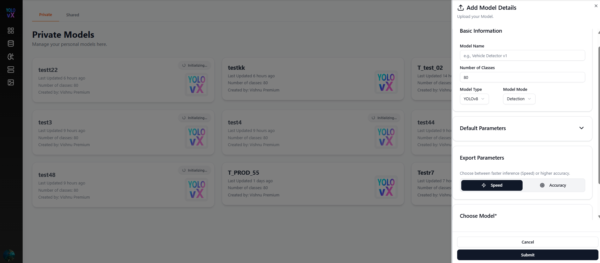
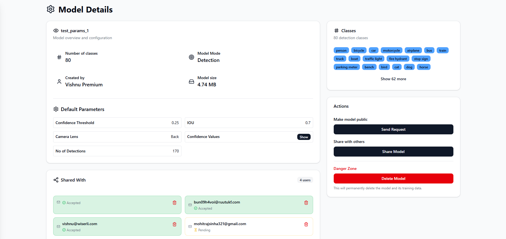

# Models – Model Management Dashboard

The **Models** page allows users to manage all object detection models available in their workspace. This includes both **private models** created by the user and **shared models** provided by teammates or the platform.

This page serves as the central hub for selecting, organizing, and managing models used for training, inference, and deployment.

---

## Page Overview

The Models page is divided into two main sections:

- **Private Models** – Models created and owned by the user.
- **Shared Models** – Models shared with the user by others or provided by the platform.

Each model is displayed as a card with key information and quick access.

---

## Top Header & Controls

The top-right header button changes based on the number of private models:

-  **If fewer than 5 private models:**  
   **Add New Model** button is displayed, allowing users to create a new model.
  

-  **If 5 or more private models:**  
   **Upgrade to Premium** button is displayed, prompting users to upgrade their plan to add more models.

- **Model Usage Counter (e.g., 5 / 5)** – Displays the number of models used versus the allowed limit for the current plan.

---

## Private Models Section

This section lists all models created by the user.

Each model card includes:

-  **Model Name** – Name of the model (e.g., *Test5*, *Test_pothole_best*).
-  **Last Updated** – When the model was last modified.
-  **Number of Classes** – Total object classes the model can detect.
-  **Created By** – Name of the creator.
-  **Model Icon** – Visual identifier for the model.

---

## Shared Models Section

This section displays models shared with the user or provided by the platform.

Each model card shows:

-  **Model Name** (e.g., *YOLOv8n-Seg*, *FlowerDetection*)
-  **Last Updated**
-  **Number of Classes**
-  **Created By** (e.g., platform or another user)

These models can be used for training, annotation assistance, and deployment depending on access permissions.

---
## Add New Model Flow

When the user clicks **➕ Add New Model**, a side panel (drawer) opens titled **“Add Model Details”**, allowing the user to upload and configure a new model.

###  Add Model Details Fields

#### Basic Information
- **Model Name** – Text input (e.g., *Vehicle Detector v1*).
- **Number of Classes** – Numeric input (default: 80).
- **Model Type** – Dropdown (e.g., *YOLOv8*).
- **Model Mode** – Dropdown (e.g., *Detection*).

####  Default Parameters
Users can configure default inference settings:

- **Confidence Threshold** – Adjustable with +/- controls (default: 0.25).
- **IOU Threshold** – Adjustable with +/- controls (default: 0.5).
- **Max Detections** – Adjustable with +/- controls (default: 10).
- **Show Confidence** – Toggle switch to show or hide confidence scores for detections.

#### Actions
- **Submit** – Saves and adds the new model.
- **Cancel** – Closes the drawer without saving.

---

## Model Card Actions

When you click on a model card, you can typically:

- View model details and configuration.
- Select the model for:
  - Training
  - Annotation assistance (Auto Labeling)
  - Deployment
- Manage model versions (if supported).
- Delete or archive models (for private models only).

