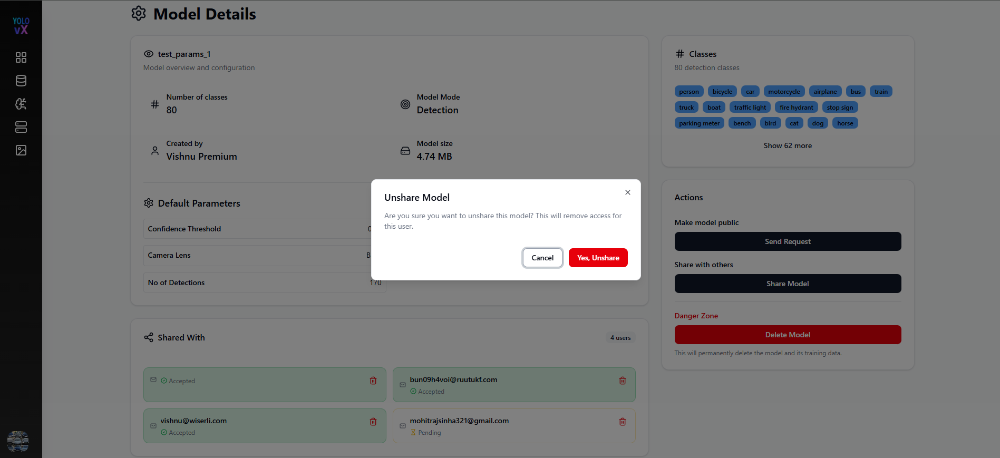
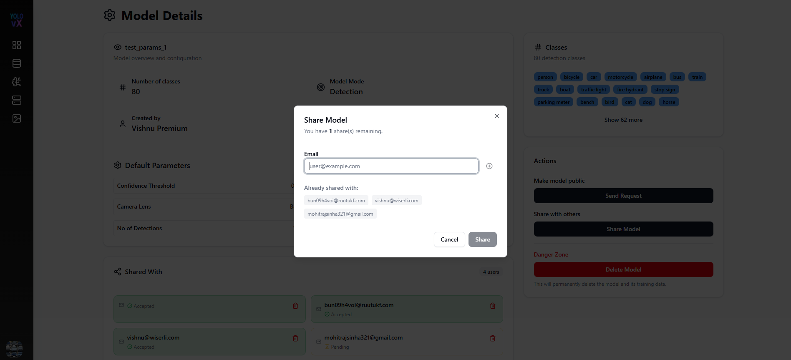
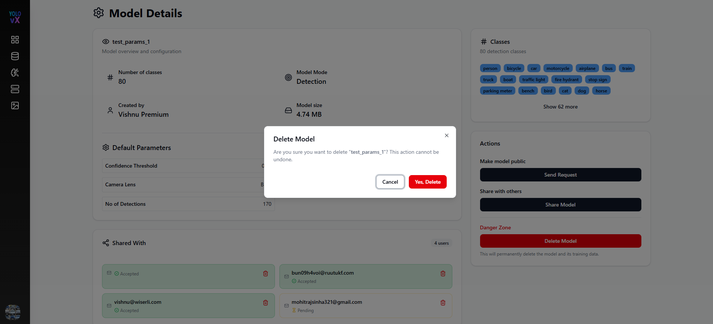

# Private Model 

This page appears when a user clicks on a **Private Model Card**. It provides complete information about the model, its configuration, sharing status, and management actions.

---

##  Model Details

This section displays the basic information and configuration of the model.

- **Model Name:** `test_params_1`
- **Number of Classes:** 80
- **Model Mode:** Detection
- **Created By:** Vishnu Premium
- **Model Size:** 4.74 MB

---

##  Default Parameters

These are the default inference parameters used by the model:

- **Confidence Threshold:** 0.25
- **IOU:** 0.7
- **Camera Lens:** Back
- **No. of Detections:** 170
- **Confidence Values:** Click the **Show** button to view detailed confidence values.

---

##  Classes

This section displays all detection classes supported by the model.

- Total Classes: **80**
- Example Classes:
  - `person`
  - `bicycle`
  - `car`
  - `motorcycle`
  - `airplane`
  - `bus`
- Click **Show more** to view the remaining classes.

---

##  Shared With

This section shows users with whom the model has been shared.

- **Accepted Users:**
  - bun09h4voi@ruutukf.com
  - test@gmail.com

- **Pending Users:**
  - test321@gmail.com

- A trash icon allows removing access for any shared user.
  Onclick delete icon a popup window will appears for confirmation of deletion of the shared model. 

---

##  Actions

Available actions for the private model:

- **Make model public:** Sends a request to make the model publicly accessible.

- **Share Model:** Allows sharing the model with other users via email. Onclick share model a popup window appears where you can share model and also view already shared models.

---

##  Danger Zone

- **Delete Model:** Permanently deletes the model and all its training data. This action is irreversible.

