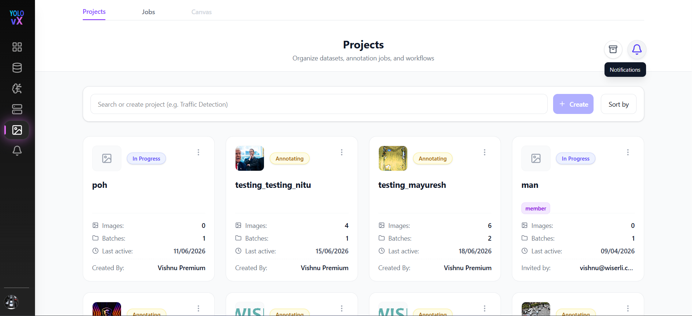
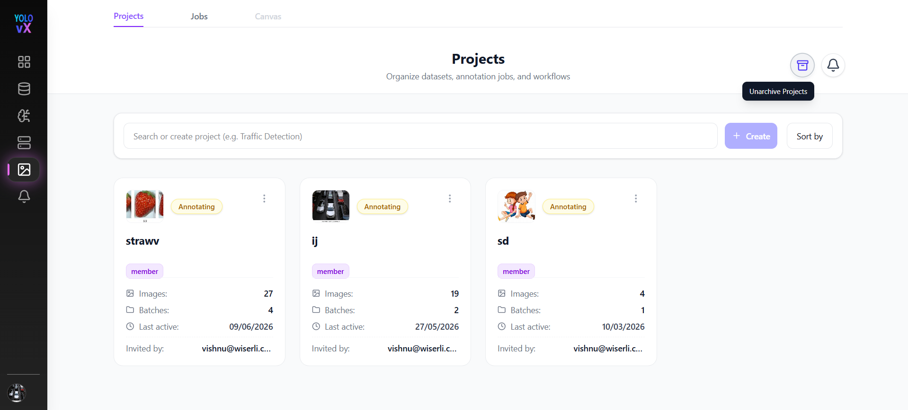
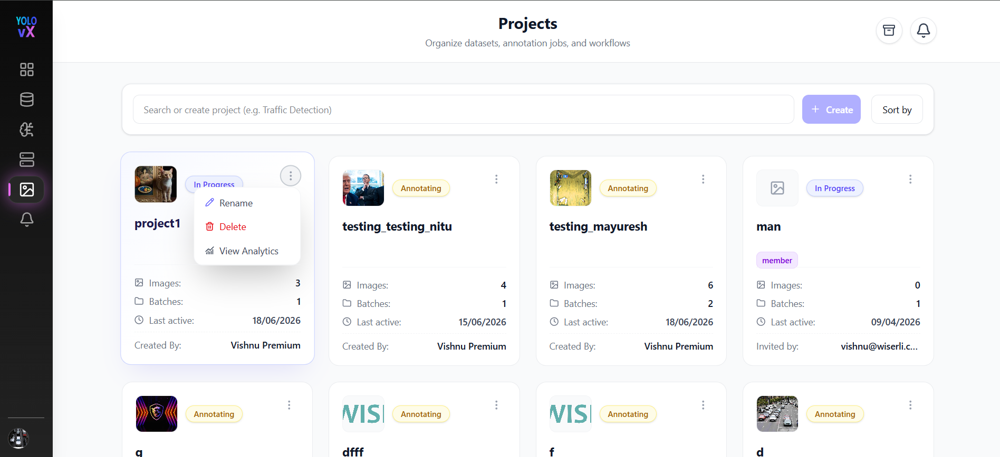
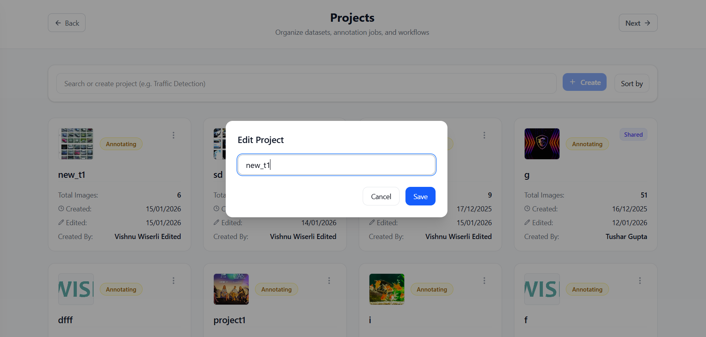
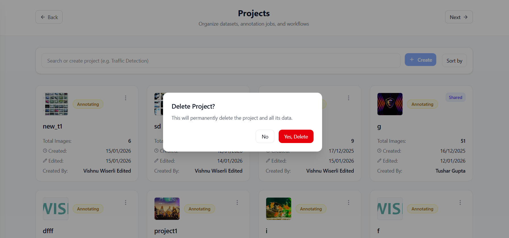
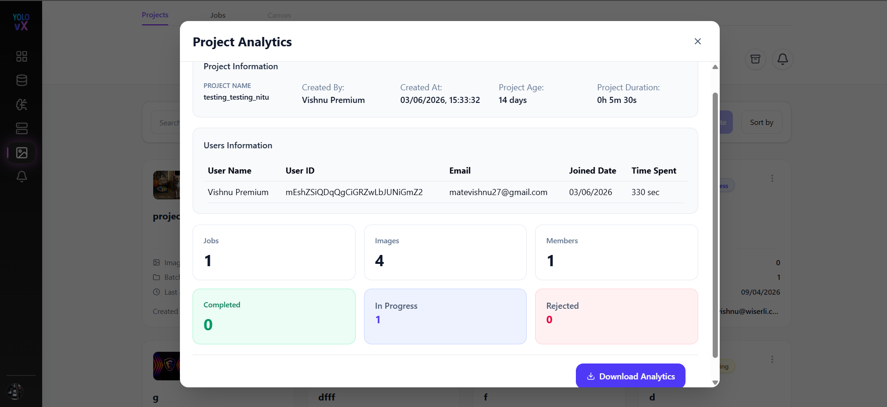

# Introduction

The **Projects** page is the central workspace where you can create and manage, and organize annotation projects by simply entering a project name in the **Create Project** input box. Each project represents a collection of job batches, and each job batch contains a set of images along with their annotation progress and metadata.

---

## Overview

On this page, you can:

- View all your projects in a card-based layout.
- Create new projects.
- Search and sort existing projects.
- Track annotation progress.
- Access shared projects.
- View project-related notifications.
- Archive projects that are no longer actively used.
- Restore archived projects when needed.
- View Analytics of Projects

---

## Project Search & Creation

At the top of the page, you will find:

-  **Search Bar** – Search existing projects by name.
-  **Create Button** – Create a new project by entering a project name (e.g., *Traffic Detection*).
-  **Sort By** – Sort projects based on date, name, or number of images.

## Notifications

The notification icon in the top-right corner provides updates related to:

- Project sharing activities.
- Annotation job assignments.
- Project status updates.
- System-generated project alerts.

Click the notification icon to view recent updates and actions related to your projects.

## Achieve Project and  Unarchive Project

Move the project from the active project list to the archive section while preserving all project data.

Restore an archived project back to the active project list.

## Project Cards

Each project is displayed as a card containing the following details:

-  **Project Thumbnail** – A preview of images in the project.
-  **Status Tag** – Shows the current state of the project (e.g.,    *Annotating*).
-  **Shared Tag** – Indicates if the project has been shared with you.
-  **Total Images** – Number of images in the project.
-  **Created Date** – When the project was created.
-  **Last Edited Date** – When the project was last updated.
-  **Created By** – The user who created the project.
-  **More Options Menu** – Click the three dots to access actions such as **Rename** , **Delete** and **View Analytics**.

## Project Actions

Click the three-dot menu on a project card to access the following actions:

## Opening a Project

 **On clicking a project card**, you will be redirected to the **Job Creation** section, where you can:

- Create multiple job batches within the selected project
- Upload images for annotation
- Manage annotation workflows for that project

---

## Rename Project

Click **Rename** from the options menu to open the **Edit Project** popup.  
Update the project name and click **Save** to apply changes or **Cancel** to discard them.

---

## Delete Project

Click **Delete** to open a confirmation popup.  
If you confirm, the project will be **permanently deleted**.  
Click **Cancel** to return without deleting.

---

## View Analytics

Open the Project Analytics page to review project statistics, team contributions, and annotation progress.

