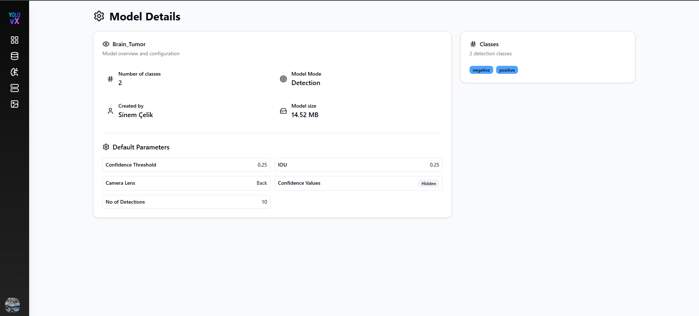

# Shared Model Card Page

This page appears when a user clicks on a **Shared Model Card**. It displays detailed information about a model that has been shared with the user, including its configuration and supported classes.

---

##  Model Details

This section shows the overview and configuration of the shared model.

- **Model Name:** `Brain_Tumor`
- **Number of Classes:** 2
- **Model Mode:** Detection
- **Created By:** Sinem Çelik
- **Model Size:** 14.52 MB

---

##  Default Parameters

These are the default inference parameters set by the model owner:

- **Confidence Threshold:** 0.25
- **IOU:** 0.25
- **Camera Lens:** Back
- **No. of Detections:** 10
- **Confidence Values:** Hidden (not visible to shared users)

---

##  Classes

This section displays the detection classes supported by the model.

- Total Classes: **2**
- Available Classes:
  - `negative`
  - `positive`

---

##  Access Level

Since this is a **shared model**, users can:
- View model details and parameters.
- Use the model for inference.
- Cannot modify, share, or delete the model.

