# Model Training

The **Training** workspace lets you fine-tune a model using a project dataset, configure training parameters, connect a GPU worker, and review the resulting model. A run is only as reproducible as its inputs, so use a frozen dataset version and record the model and training configuration for each run.

## Training Workflow

1. Prepare and review annotations for the project.
2. Freeze a dataset version and confirm its class labels and train, validation, and test splits.
3. Select a base model and configure the training pipeline.
4. Connect and health-check a GPU worker.
5. Start the run, monitor its status, and review validation metrics.
6. Download and verify the resulting weights before registering or deploying the model.

## Before You Start

- Confirm that your account can access the project, dataset, and private model used for training.
- Review annotations for missing labels, inconsistent class names, and unsuitable images before freezing the dataset.
- Use a frozen dataset version for a repeatable run. Live data can change while annotation work continues.
- Keep the test split separate from training decisions. Use it for final evaluation rather than tuning parameters against it.
- Confirm that the selected model, dataset format, and worker environment are compatible with the training pipeline.

## Prepare the Model and Dataset

### Register or Select a Model

To add a base model, open **Models** > **Private** and select **Add Model**. Enter a descriptive model name, class count, model type, and mode, then upload weights in a format supported by the form.

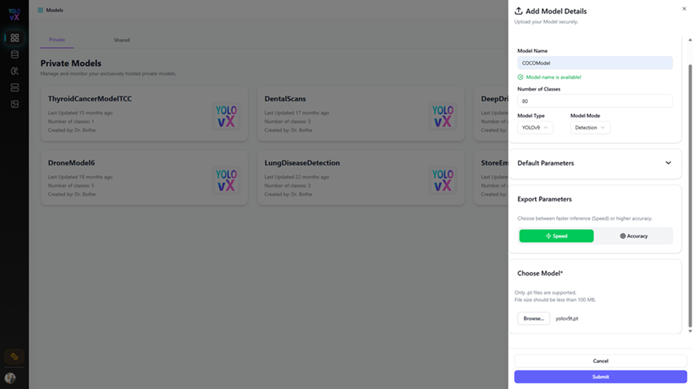

After saving, open the model details and verify the model type, class count, and inference settings. Class names and ordering should match the dataset labels expected by the training run.

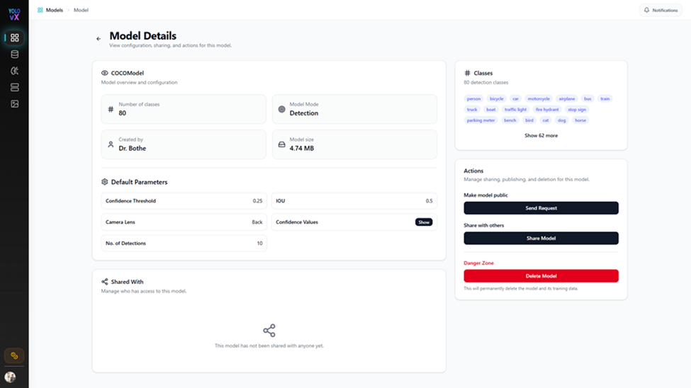

### Review Annotations

Open the project's annotation canvas and review auto-generated labels before using them as training data. Correct inaccurate boxes, add labels for required classes, and submit the batch through the project's review workflow.

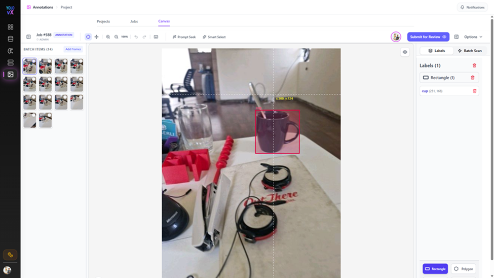

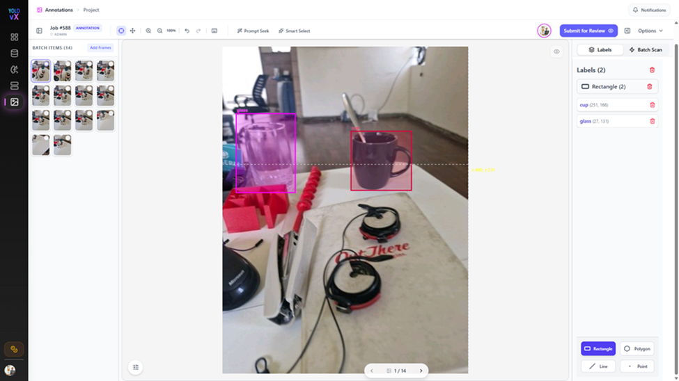

### Freeze and Export a Dataset

Open **Datasets** from the project and create a frozen version after annotation review is complete. Check image and instance counts, class distribution, and split percentages before using the version for training.

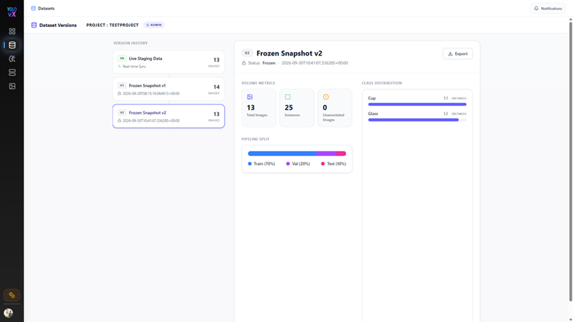

If an external workflow requires an exported dataset, select **Export** on the frozen version, choose a supported format, and include images when required by that workflow.

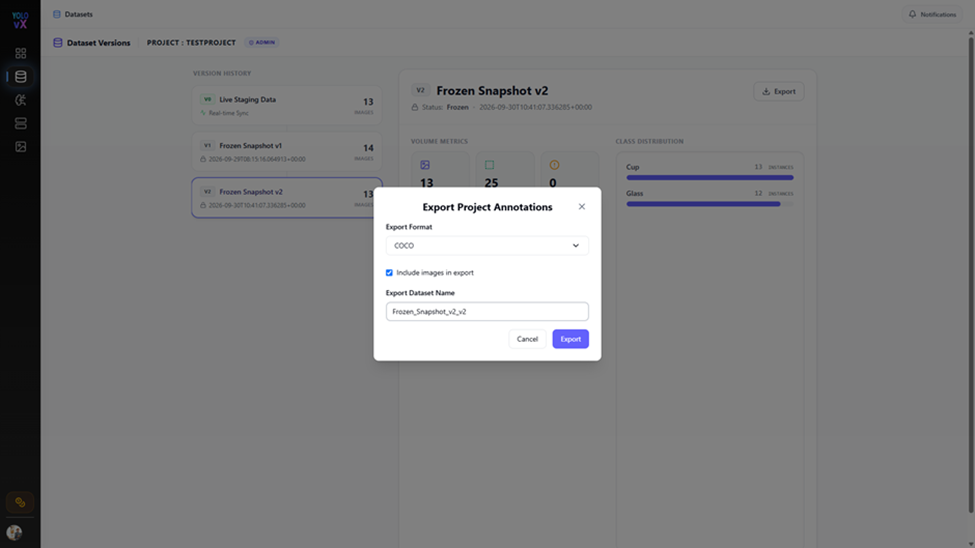

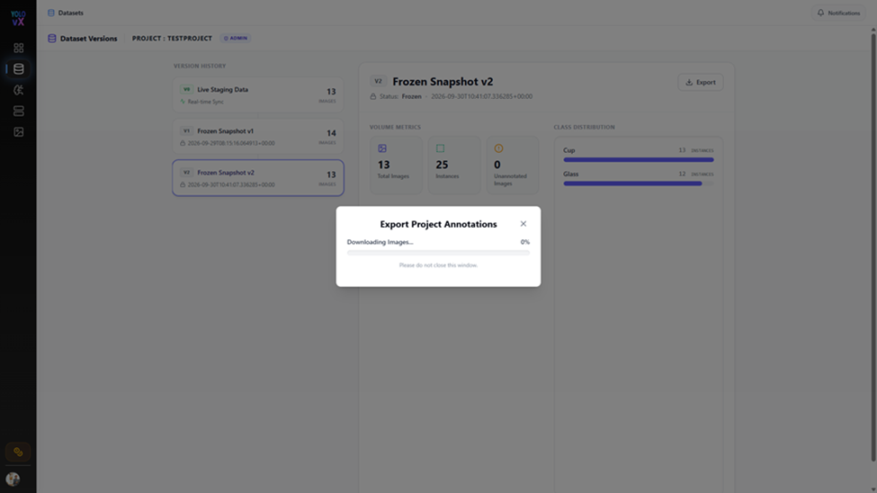

## Configure a Training Run

Open **Training** > **Remote Fine-Tuning Hub** and complete the stages in order. Available options and defaults may vary by model and workspace.

| Stage | Configure |
| --- | --- |
| **Dataset** | Select the project and the live dataset or frozen version. For reproducible runs, select a frozen version. |
| **Model** | Select the training mode and compatible base model. |
| **Training** | Set the available hyperparameters, such as epochs, image size, batch size, and optimizer. |
| **Advanced** | Review the available learning-rate, loss, augmentation, and early-stopping settings. Change defaults only when the experiment requires it. |
| **GPU Worker** | Connect the external worker and verify its health before dispatching the run. |

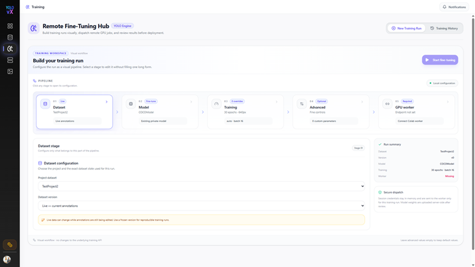

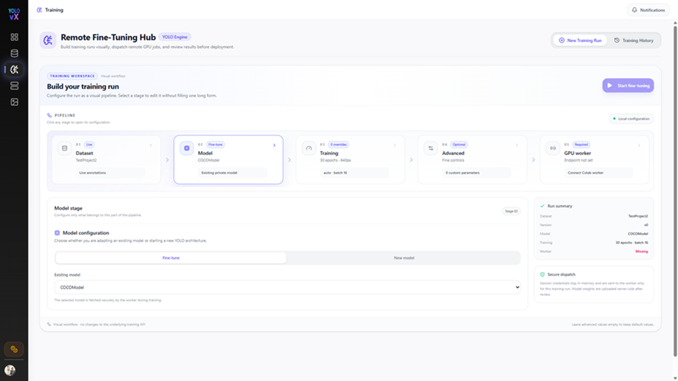

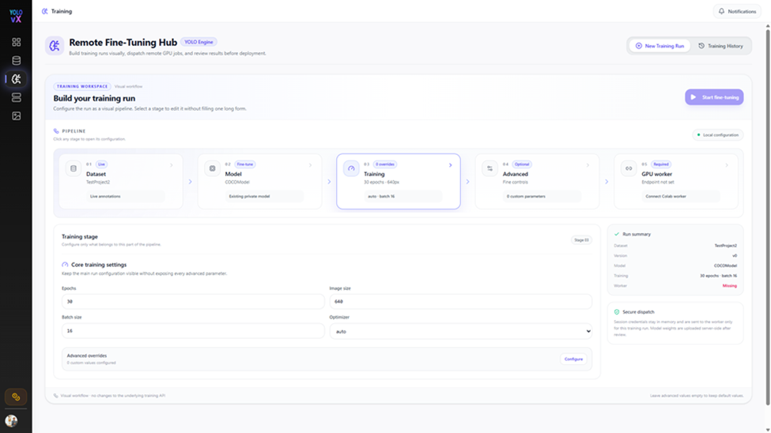

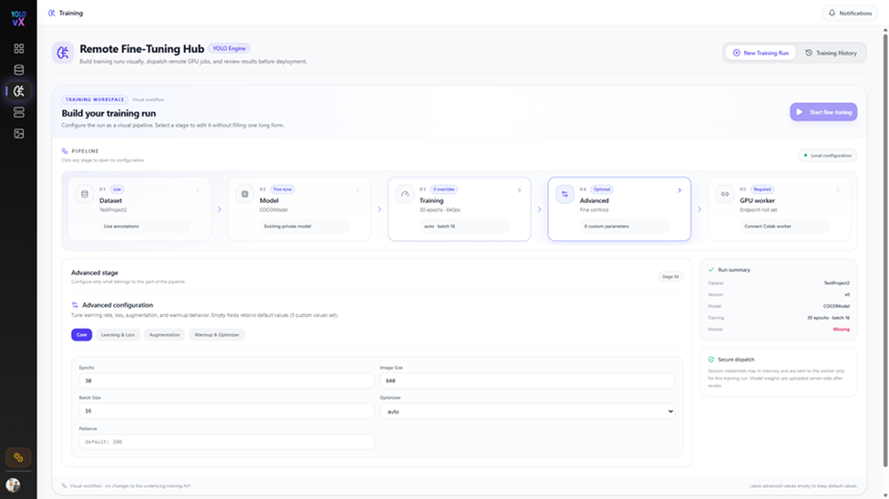

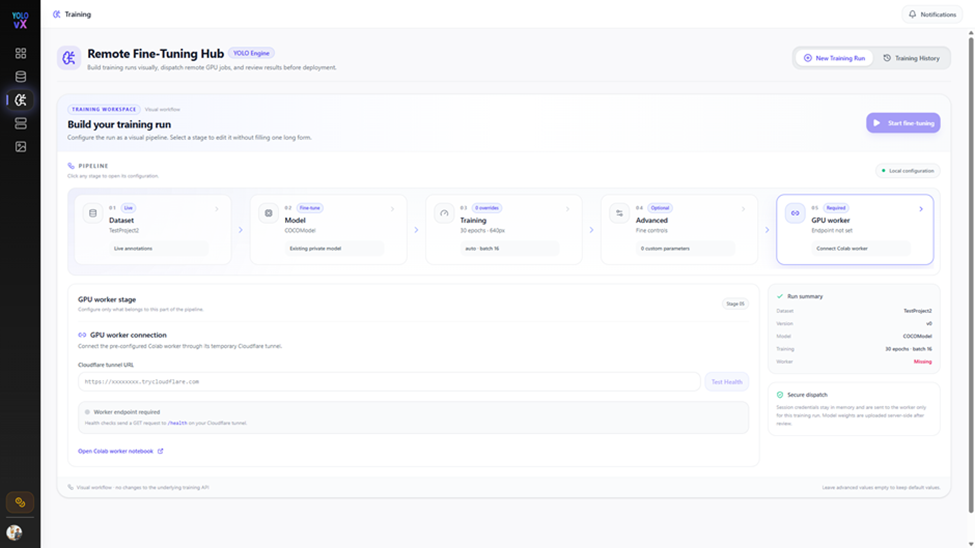

!!! tip "Keep runs reproducible"
    Record the dataset version, model and weights, class mapping, parameter values, and worker environment for each experiment. Change one group of parameters at a time when comparing runs.

## Connect a GPU Worker

The documented worker setup uses the provided Google Colab notebook. A compatible GPU runtime must remain available for the duration of the run.

1. From Stage 05, open the Colab worker notebook.
2. Select an available GPU runtime in Colab.
3. Run the notebook setup cell to install its listed dependencies.
4. Run the server cell and copy the generated tunnel URL.
5. Return to Stage 05, enter the URL, and select **Test Health**. Start training only after the health check passes.

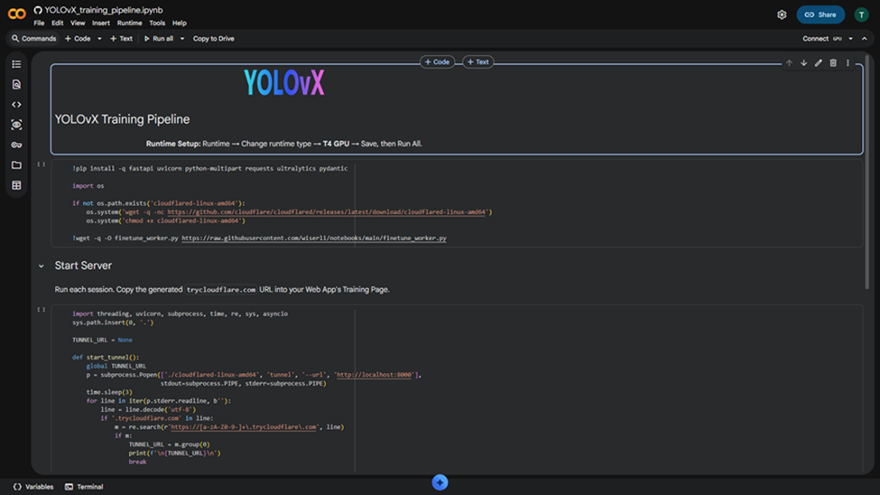

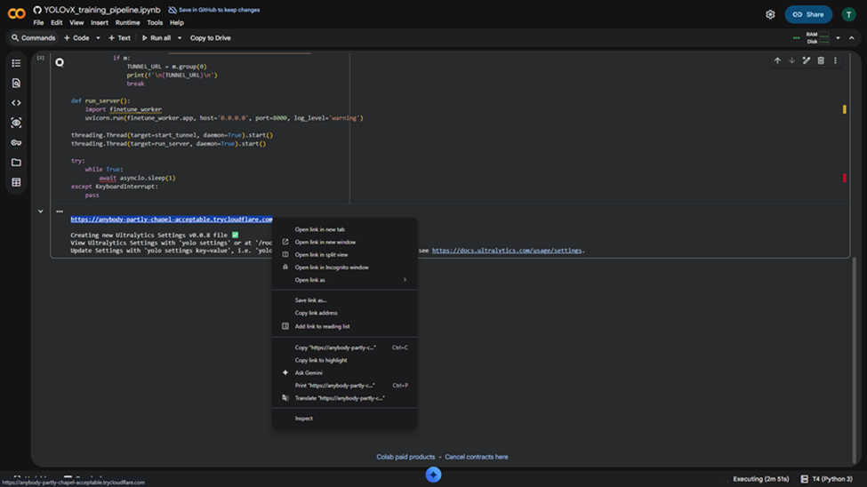

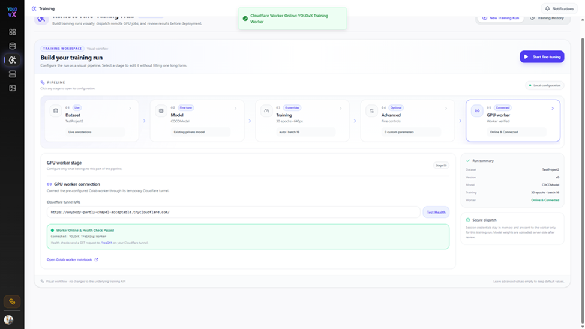

!!! warning "External worker and tunnel"
    A Colab runtime and its temporary tunnel are external services. Use only data approved for that environment, and follow your organization's data-handling requirements. Treat the tunnel URL as sensitive, do not publish it, and never put credentials or access tokens in documentation. If the runtime or tunnel restarts, reconnect with the new URL and repeat the health check.

## Start and Monitor Training

Review the selected dataset, model, and parameter values, then select **Start fine-tuning**. Follow the run in **Training History** and keep the worker session active while work is in progress. If the run fails or stops unexpectedly, check the run details and worker output before retrying.

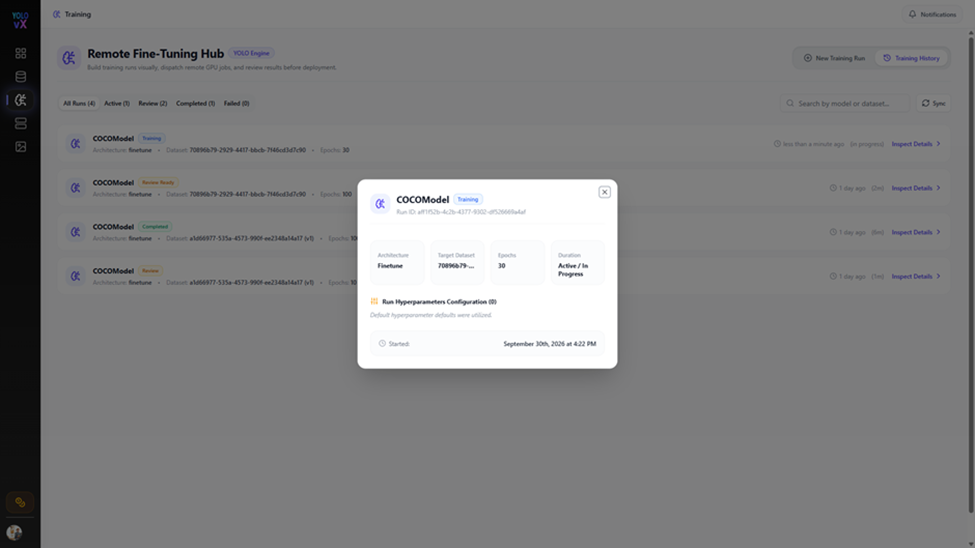

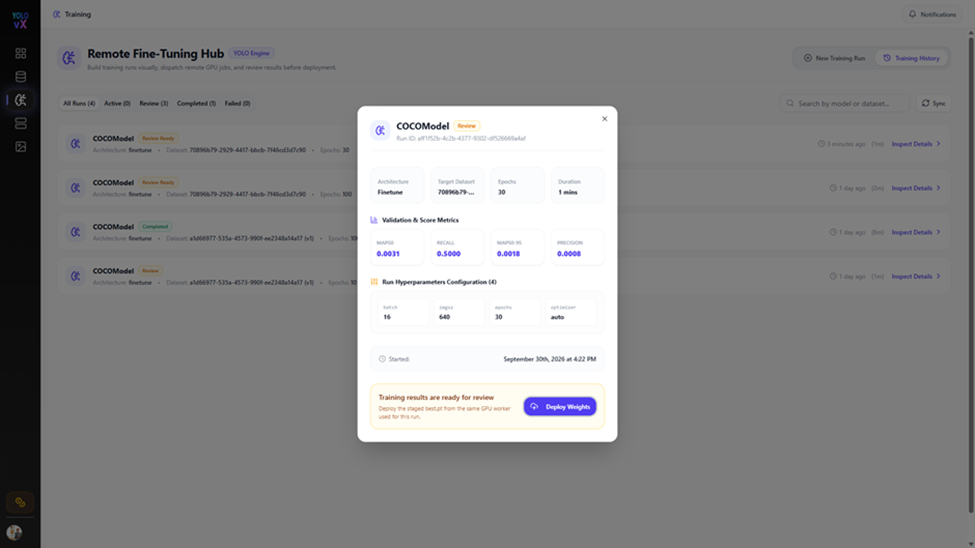

## Evaluate the Results

Open the completed run and select **Inspect Details** to review its metrics. Compare results against the intended task and a baseline evaluated on the same data split; no single metric value is a universal acceptance threshold.

| Metric | What it indicates |
| --- | --- |
| **Precision** | Of the model's positive detections, the proportion that are correct. |
| **Recall** | Of the ground-truth objects, the proportion the model detects. |
| **mAP50** | Mean average precision at an intersection-over-union threshold of 0.50. |
| **mAP50-95** | Mean average precision averaged across intersection-over-union thresholds from 0.50 to 0.95. |

Review per-class results where available. A strong aggregate score can hide weak performance on less frequent classes. Investigate label quality, class imbalance, split composition, and false positives or missed detections before deciding whether a run is ready for use.

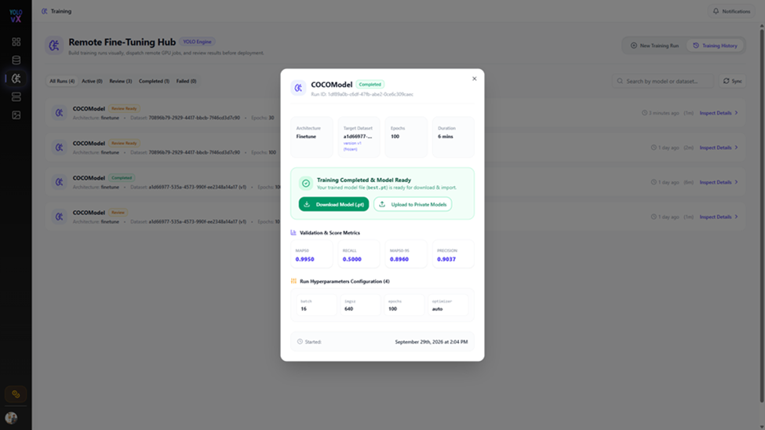

## Download and Register the Model

When the run is complete and its results have been reviewed:

1. Select **Download Model (.pt)** to download the trained weights.
2. Verify the downloaded artifact and retain its association with the training run and dataset version.
3. Select **Upload to Private Models** to add the trained model to the private model registry.
4. Give the model a clear name or version and verify its class mapping before using it for inference.

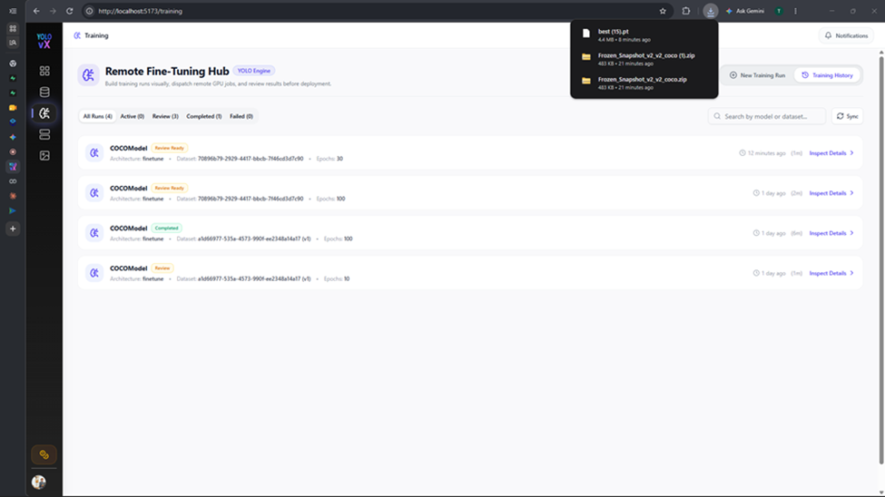

Registration makes the model available for supported YOLOvX workflows; it does not by itself validate production suitability. Test the model on representative data and follow your deployment review process before release.

## Troubleshooting

| Symptom | Checks |
| --- | --- |
| Worker health check fails | Confirm the notebook server is running, the runtime is connected, and the current tunnel URL was copied without extra characters. Recreate the tunnel and test again if it has expired. |
| Training cannot start | Confirm all required stages are configured, the selected dataset and model are accessible, and the worker health check passes. |
| Run stops or disconnects | Check whether the external runtime is still active and review the run details and worker output. Restarting a runtime may require reconnecting the tunnel. |
| Metrics are unexpectedly low | Review annotation quality, class mappings, dataset splits, class balance, and the training configuration. Compare with a baseline on the same evaluation data. |
| Model is unavailable for inference | Verify that registration completed, the model mode and class mapping are correct, and the target workflow supports the model artifact. |

---

## Related Pages

- [Models](models.md)
- [Datasets](datasets.md)
- [Annotations](annotations.md)